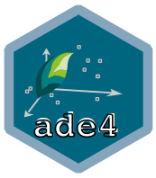

# [ade4](http://pbil.univ-lyon1.fr/ADE-4/) 

[](http://cran.r-project.org/package=ade4)
[](https://cran.r-project.org/package=ade4)
[](https://github.com/adeverse/ade4/actions/workflows/R-CMD-check.yaml)
[](https://www.gnu.org/licenses/gpl-3.0)

Analysis of Ecological Data: Exploratory and Euclidean Methods in Environmental Sciences

---------------------------

**Please note! Since January 2024, this repository has belonged to the *adeverse* organization.**
To avoid confusion, we strongly recommend updating any existing local clones to point to the new 
repository URL. You can do this by using `git remote` on the command line:

`git remote set-url origin git@github.com:adeverse/ade4.git`

or 

`git remote set-url origin https://github.com/adeverse/ade4.git`

---------------------------


Installing the development version of `ade4`
-------------

- Install the release version of `remotes` from CRAN with `install.packages("remotes")`.

- Make sure you have a working development environment.
    * **Windows**: Install [Rtools](http://cran.r-project.org/bin/windows/Rtools/).
    * **Mac**: Install Xcode from the Mac App Store.
    * **Linux**: Install a compiler and various development libraries (details vary across different flavors of Linux).
    
Then:

```r
remotes::install_github("adeverse/ade4")
```


If you do not wish to install the development environments Rtools (Windows) / XCode (Mac), we can supply binary packages of the development version of `ade4` on request. 

You can also find these binary packages as artifacts of GitHub Actions: [here](https://github.com/adeverse/ade4/actions/workflows/build-bin-windows.yaml) for Windows and [here](https://github.com/adeverse/ade4/actions/workflows/build-bin-macOS-x64.yaml) and [here](https://github.com/adeverse/ade4/actions/workflows/build-bin-macOS-M1.yaml) for macOS.


Installing the stable version of `ade4`
-------------

```r
install.packages("ade4")
```


Loading `ade4`
-------------

```r
library("ade4")
```
