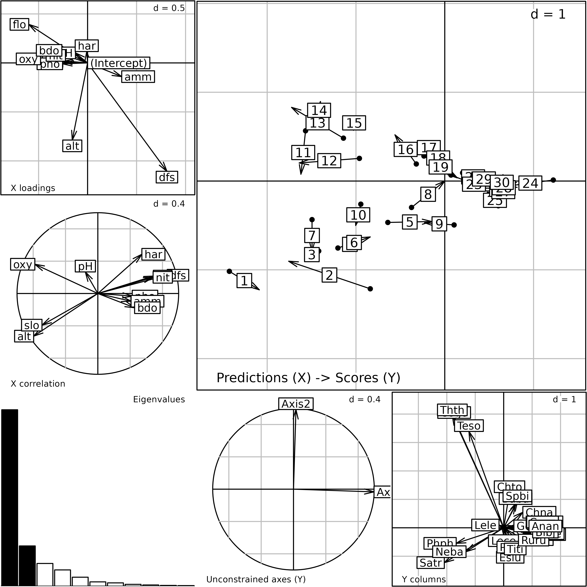
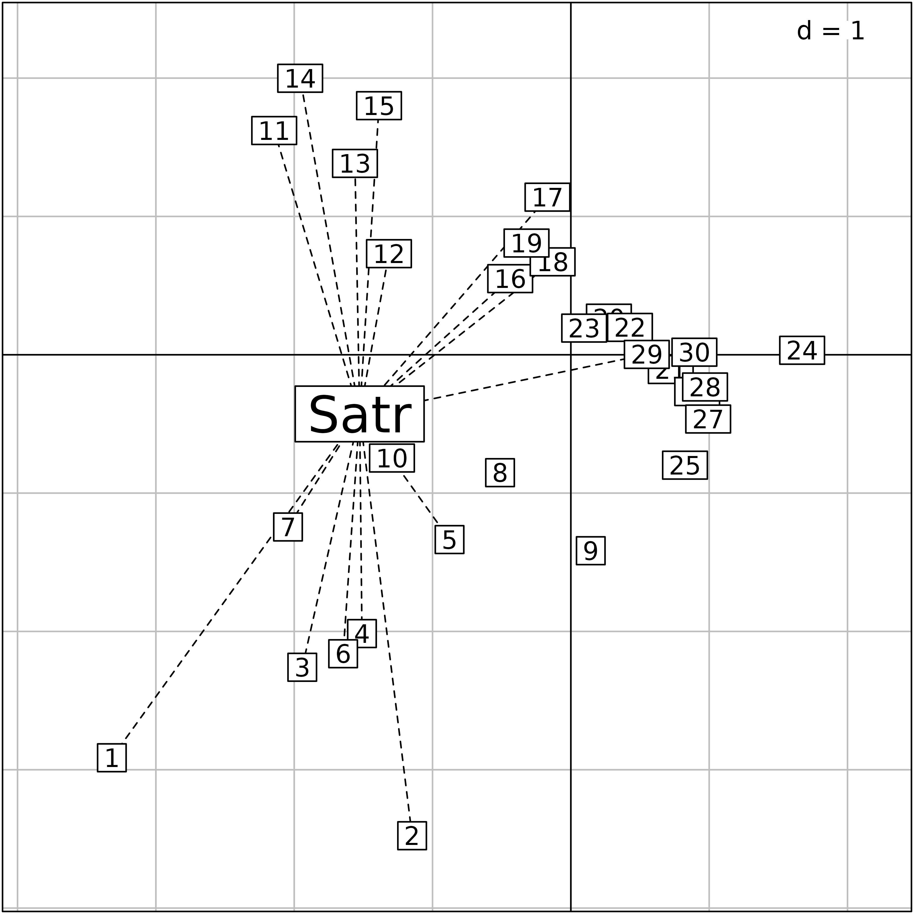

# Description of species-environment relationships

## Abstract

This vignette shows how direct and indirect gradient analysis can be
handled in the **ade4** package, with a special emphasis on three direct
ordination methods: Coinertia Analysis, Redundancy Analysis and
Canonical Correspondence Analysis.

## Introduction

Simple methods presented in vignettes 2 (Description of environmental
variables structures) and 3 (Description of species structures) describe
environmental or species structures independently. However, an important
question in Ecology is the analysis of the relationships between these
two structures with the aim of understanding if/how the organisation of
ecological communities is linked to environmental variations. In this
chapter, we focus on the case where a number of sites are described by
environmental variables *and* species composition. This leads to
consider two tables with the same rows (*i.e.*, the sites).
Historically, ecologists have first used indirect approaches for
interpreting the structures of species assemblages (structural
information extracted by the analysis of the species data) in relation
to environmental variability. Site scores along the ordination axes,
which are composite indices of species abundances were compared *a
posteriori* to environmental variables (*indirect ordination*, *indirect
gradient analysis*). Progressively, new techniques were developed to
constrain the ordination according to the table of explanatory
environmental variables (*direct ordination*, *direct gradient
analysis*).

## Indirect ordination

The `doubs` data set has been described in vignettes 2 and 3. In
indirect ordination methods, community data are first summarised and
then interpreted in the light of environmental information. For
instance, we apply a centred PCA on the species data while the
environmental table is treated by a standardised PCA. Two axes are kept
for each analysis.

``` r
library(ade4)
library(adegraphics)
data(doubs)
pca.fish <- dudi.pca(doubs$fish, scale = FALSE, scannf = FALSE, nf = 2)
pca.env <- dudi.pca(doubs$env, scannf = FALSE, nf = 2)
```

To interpret the outputs of the species ordination, correlations between
the axes kept in the two analyses can be computed:

``` r
cor(pca.env$li, pca.fish$li)
```

    #>            Axis1     Axis2
    #> Axis1  0.5682058 0.3483176
    #> Axis2 -0.4679404 0.6308694

The two ordinations are strongly linked. The first two axes of the fish
ordination (columns) are linked to the two main environmental gradients
(first two axes of PCA of the environmental table). To facilitate the
interpretation, correlations can be computed between original
environmental variables and species ordination scores:

``` r
cor(doubs$env, pca.fish$li)
```

    #>           Axis1        Axis2
    #> dfs  0.81690724  0.113670362
    #> alt -0.67742048  0.001438816
    #> slo -0.57154952  0.093089123
    #> flo  0.78476404 -0.013730306
    #> pH  -0.04933278 -0.252401703
    #> har  0.44764032  0.038390495
    #> pho  0.11485956  0.537131173
    #> nit  0.46860409  0.309248079
    #> amm  0.08400315  0.557866204
    #> oxy -0.40335527 -0.655908104
    #> bdo  0.08547836  0.702449371

The first axis is mainly correlated to geomorphological variables
(distance from the source, flow, altitude, slope) whereas the second
axis is more linked to chemical processes (biological demand for oxygen,
dissolved oxygen, ammonium and phosphate). Note that the computation of
these correlations is exactly equivalent to the projection, as
supplementary elements, of the standardised environmental variables on
the factorial map of the fish ordination. This projection step can be
performed by the `supcol` function.

``` r
supcol.env <- supcol(pca.fish, pca.env$tab)
head(supcol.env$cosup)
```

    #>           Comp1        Comp2
    #> dfs  0.81690724  0.113670362
    #> alt -0.67742048  0.001438816
    #> slo -0.57154952  0.093089123
    #> flo  0.78476404 -0.013730306
    #> pH  -0.04933278 -0.252401703
    #> har  0.44764032  0.038390495

These correlations can also be depicted on a correlation circle.

``` r
s.corcircle(supcol.env$cosup)
```


Correlations between environmental variables and sites scores on the
first two axes of the PCA of fish species data.

Symmetrically, **ade4** also offers the possibility to represent
supplementary sites (which have not been involved in the computation of
an analysis) using the `suprow` function. This can be useful for
prediction purposes, allowing to compute an analysis on a number of
reference sites and then using this model to evaluate the position for
new sites.

It is usually assumed that environmental variables influence the
distribution of species. In this context, it would be more appropriate
to use a regression model to explain the fish species composition by
environmental explanatory variables (e.g.,
`lm(pca.fish$li[, 1] ~ as.matrix(doubs$env))`). A variable selection
procedure can be used to avoid overfitting and multicollinearity issues
due to the high number (relative to the number of statistical units,
i.e., sites) of correlated explanatory variables.

The main advantage of indirect ordination is its simplicity. Its main
drawback is its lack of optimality: species ordination reveals the main
patterns of community assemblage but does not guarantee that these
structures are linked to environmental gradients. If a study focuses on
species-environment relationships, two-table methods, that consider both
environmental and species tables simultaneously, should be preferred.

## Coinertia Analysis

As shown above, simple multivariate analyses are useful to identify the
main environmental and species structures separately. Coinertia Analysis
(Doledec 1994, Dray 2003c) aims to reveal the main co-structures
(*i.e.*, the structures common to both data sets) by combining these
separate ordinations into a single analysis. This two-table method is
based on the computation of a crossed array (cross-covariance matrix)
that measures the relationships between the variables of both data sets.

In the **ade4** package, the `coinertia` function is used to compute a
Coinertia Analysis. All the outputs of this function are grouped in a
`dudi` object (subclass `coinertia`).

The first two arguments of the `coinertia` function are the two `dudi`
objects corresponding to the analyses of the two data tables. The two
other arguments, `scannf` and `nf`, have the same meaning as in the
other analysis functions.

Species and environmental tables should be analysed separately and then
the `coinertia` function can be applied to compute the Coinertia
Analysis:

``` r
(coia.doubs <- coinertia(pca.fish, pca.env, scannf=FALSE))
```

    #> Coinertia analysis
    #> call: coinertia(dudiX = pca.fish, dudiY = pca.env, scannf = FALSE)
    #> class: coinertia dudi 
    #> 
    #> $rank (rank)     : 11
    #> $nf (axis saved) : 2
    #> $RV (RV coeff)   : 0.4505569
    #> 
    #> eigenvalues: 119 13.87 0.7566 0.5278 0.2709 ...
    #> 
    #>   vector length mode    content                        
    #> 1 $eig   11     numeric Eigenvalues                    
    #> 2 $lw    11     numeric Row weigths (for pca.env cols) 
    #> 3 $cw    27     numeric Col weigths (for pca.fish cols)
    #> 
    #>    data.frame nrow ncol content                                           
    #> 1  $tab       11   27   Crossed Table (CT): cols(pca.env) x cols(pca.fish)
    #> 2  $li        11   2    CT row scores (cols of pca.env)                   
    #> 3  $l1        11   2    Principal components (loadings for pca.env cols)  
    #> 4  $co        27   2    CT col scores (cols of pca.fish)                  
    #> 5  $c1        27   2    Principal axes (loadings for pca.fish cols)       
    #> 6  $lX        30   2    Row scores (rows of pca.fish)                     
    #> 7  $mX        30   2    Normed row scores (rows of pca.fish)              
    #> 8  $lY        30   2    Row scores (rows of pca.env)                      
    #> 9  $mY        30   2    Normed row scores (rows of pca.env)               
    #> 10 $aX        2    2    Corr pca.fish axes / coinertia axes               
    #> 11 $aY        2    2    Corr pca.env axes / coinertia axes                
    #> 
    #> CT rows = cols of pca.env (11) / CT cols = cols of pca.fish (27)

The `plot` function can be used to display the main outputs of the
analysis. The barplot of eigenvalues (bottom-left) clearly indicates
that two dimensions should be used to interpret the main structures of
fish-environment relationships.

``` r
plot(coia.doubs)
```


Plot of the outputs of a Coinertia Analysis. This is a composite plot
made of six graphs (see text for an explanation of the six graphs).

Coinertia Analysis computes coefficients for environmental variables
(`$l1`) and fish species (`$c1`) which are represented on the two graphs
at the bottom of the plot (**Y** and **X** loadings). Hence, it is
possible to interpret the different axes and identify relationships
between variables of both data sets. The three groups (trout, grayling
and downstream) are identified and their position is linked to the
geomorphological variables on the first axis and to chemical variables
on the second axis. For instance, the three species of the trout group
(`Satr`, `Phph` and `Neba`) are present in upstream sites (high altitude
and slope, low flow, etc.) where the oxygen concentration is high and
the ammonium and phosphate concentrations are low. These loadings are
used to compute two sets of site scores allowing to position sites by
their species composition (`$lX`) or by their environmental conditions
(`$lY`). Coinertia Analysis maximises the squared covariances between
these two sets of scores.

The top-right graph of the plot represents sites by normed versions of
these scores (`$mX` and `$mY`). Each site corresponds to an arrow (the
start corresponds to its species score and the head to its environmental
score). A short arrow reveals a good agreement between the environmental
conditions of a site and its species composition while a long arrow
indicates a discrepancy. For instance, the long arrows for sites `1`,
`8`, `23`, `24` and `25` reveal that these sites have few species and
similar composition (the start of the arrows are close and located at
the opposed direction of the species arrows) but very different
environmental conditions (the head of these arrows are spread out).
Hence, these sites can be seen as outliers in the global model of
species-environment relationships identified by Coinertia Analysis
because their species composition did not correspond to their
environmental conditions. Indeed, species abundance and richness in
these sites are very low due to pollution or to the fact that fish
richness is also very low near the source of the stream.

Lastly, the two graphs on the left show the projection of the first axes
of the two initial simple analyses (`pca.fish` and `pca.env`) onto the
coinertia axes. These graphs provide a convenient way to look at the
relationships between the main structures of each data set (identified
by simple analyses) and the co-structures identified by Coinertia
Analysis. For fish species data, the first two axes of the simple PCA
are nearly equivalent to the coinertia axes. For environmental data, a
rotation has been performed so that a coinertia axis mixes the
structures of two PCA axes.

The `summary` function provides several useful results about the
analysis, especially concerning the criteria maximised:

``` r
summary(coia.doubs)
```

    #> Coinertia analysis
    #> 
    #> Class: coinertia dudi
    #> Call: coinertia(dudiX = pca.fish, dudiY = pca.env, scannf = FALSE)
    #> 
    #> Total inertia: 134.7
    #> 
    #> Eigenvalues:
    #>      Ax1      Ax2      Ax3      Ax4      Ax5 
    #> 119.0194  13.8714   0.7566   0.5278   0.2709 
    #> 
    #> Projected inertia (%):
    #>     Ax1     Ax2     Ax3     Ax4     Ax5 
    #> 88.3570 10.2978  0.5617  0.3918  0.2011 
    #> 
    #> Cumulative projected inertia (%):
    #>     Ax1   Ax1:2   Ax1:3   Ax1:4   Ax1:5 
    #>   88.36   98.65   99.22   99.61   99.81 
    #> 
    #> (Only 5 dimensions (out of 11) are shown)
    #> 
    #> Eigenvalues decomposition:
    #>         eig     covar      sdX      sdY      corr
    #> 1 119.01942 10.909602 6.422570 2.326324 0.7301798
    #> 2  13.87137  3.724429 2.863743 1.685078 0.7718017
    #> 
    #> Inertia & coinertia X (pca.fish):
    #>     inertia      max     ratio
    #> 1  41.24940 42.74627 0.9649824
    #> 12 49.45042 50.90461 0.9714331
    #> 
    #> Inertia & coinertia Y (pca.env):
    #>     inertia      max     ratio
    #> 1  5.411785 6.321624 0.8560752
    #> 12 8.251272 8.553220 0.9646978
    #> 
    #> RV:
    #>  0.4505569

As for any object inheriting from the `dudi` class, the eigenvalues and
percentages of (cumulative) projected inertia are returned. Information
on the eigenvalues and their decomposition is also returned. Eigenvalues
in Coinertia Analysis are squared covariances between linear
combinations of species abundances (`$lX`) and environmental variables
(`$lY`). The table `Eigenvalues decomposition` returns the eigenvalues
(`eig`) and their square root (`covar`). The covariance is equal to the
product of the correlation between `$lX` and `$lY` (`corr`), the
standard deviation of the environmental score `$lY` (`sdY`) and the
standard deviation of the species score `$lX` (`sdX`). The maximal
possible values for the standard deviations are produced by the simple
analyses of the initial tables (`pca.fish`, `pca.env`) that identify the
main structures of each data set. The two tables `Inertia & coinertia`
compare the quantity of variance captured by the Coinertia Analysis
(`inertia`) to the maximum possible value provided by the simple
analysis (`max`). Hence it is possible to ensure that an important
proportion of the information contained in each table (structures) is
preserved when looking for co-structures (`ratio`).

Lastly, the `summary` function returns the value of the RV coefficient
(Escoufier 1973) that measures the link between two tables. It can been
seen as an extension of the bivariate squared correlation coefficient to
the multivariate case. It varies between 0 (no correlation) and 1
(perfect agreement) and its significance can be tested by random
permutation of the rows of both tables (function `randtest`):

``` r
randtest(coia.doubs)
```

    #> Monte-Carlo test
    #> Call: randtest.coinertia(xtest = coia.doubs)
    #> 
    #> Observation: 0.4505569 
    #> 
    #> Based on 999 replicates
    #> Simulated p-value: 0.001 
    #> Alternative hypothesis: greater 
    #> 
    #>     Std.Obs Expectation    Variance 
    #> 8.052938433 0.085152650 0.002058915

In this case, the link between the composition of species assemblages
and environmental conditions is highly significant.

Coinertia Analysis maximises covariances and thus can handle tables
containing more variables than individuals. Its framework is very
general and flexible: the `coinertia` function takes two `dudi` objects
as arguments and thus can be used to link tables containing quantitative
variables (`dudi.pca`), qualitative variables (`dudi.acm`), mix of both
(`dudi.hillsmith`), fuzzy variables (`dudi.fca`), distance matrices
(`dudi.pco`), etc. The only restriction is that rows (i.e., individuals)
of the two tables are identical and that the same row weights are used
in the two separate analyses. This implies to take some precautions,
especially when Correspondence Analysis (CA) is used because this method
is based on the computation of particular row weights. In this case, CA
row weights should be introduced in the analysis of the second table:

``` r
coa.fish <- dudi.coa(doubs$fish, scannf = FALSE, nf = 2)
pca.env2 <- dudi.pca(doubs$env, row.w = coa.fish$lw,
    scannf = FALSE, nf = 2)
coia.doubs2 <- coinertia(coa.fish, pca.env2, scannf = FALSE, nf = 2)
```

As CA row weights have been computed using species abundance contained
in the `doubs$fish` table, the permutation procedure should keep the
association between the row weights and the rows of the first table.
This is achieved using the `fixed` argument of the `randtest` function,
thus permuting only the rows of the second table:

``` r
randtest(coia.doubs2, fixed = 1)
```

    #> Warning: non uniform weight. The results from permutations
    #> are valid only if the row weights come from the fixed table.
    #> The fixed table is table X : doubs$fish

    #> Monte-Carlo test
    #> Call: randtest.coinertia(xtest = coia.doubs2, fixed = 1)
    #> 
    #> Observation: 0.636319 
    #> 
    #> Based on 999 replicates
    #> Simulated p-value: 0.001 
    #> Alternative hypothesis: greater 
    #> 
    #>      Std.Obs  Expectation     Variance 
    #> 10.929489203  0.105364563  0.002360015

## Analysis on instrumental variables

In species-environment studies, it is often assumed that environmental
conditions influence species distributions. Coinertia Analysis is based
on a covariance criteria and thus does not take into account this
asymmetric relationship. Methods based on instrumental variables (also
known as constrained/canonical ordination) consider explicitly that a
table contains response variables that must be explained by a second
table of explanatory (instrumental) variables. They allow to identify
the main structures of the first table that are explained by the
variables in the second table. In **ade4**, this way to go is provided
by the `pcaiv` function. Redundancy Analysis (Rao 1964, Wollenberg1977)
and Canonical Correspondence Analysis (terBraak 1986) are two particular
cases of such approach.

The `pcaivortho` function performs an analysis on orthogonal
instrumental variables that focuses on the structures of the response
variables that are **not** explained by the instrumental variables (Rao
1964). They are equivalent to pRDA and pCCA, *i.e.*, partial CCA and
RDA.

### Redundancy Analysis

Redundancy Analysis (RDA) is a particular analysis on instrumental
variables corresponding to the case where the table of response
variables (i.e., species abundances) is treated by a PCA.

In practice, RDA is the PCA of a table containing the predicted values
of species abundances by environmental variables.

In **ade4**, the `pcaiv` function is used to compute a RDA. All the
outputs of this function are grouped in a `dudi` object (subclass
`pcaiv`).

The `pcaiv` function takes two main arguments: an analysis of the
response table (a `dudi` object) and a table of explanatory variable (an
object of class `data.frame`). In **ade4**, the user must first use the
`dudi.pca` function to identify the main variations in species
composition and then use the `pcaiv` function to introduce environmental
variables. This two-step implementation has a pedagogical aim by forcing
users to interpret simple (unconstrained) structures before analysing
structures explained by external variables. The outputs of the
constrained and unconstrained analyses can then be compared to evaluate
the role of explanatory variables.

RDA is performed by applying the `pcaiv` function with the `pca.fish`
object as first argument:

``` r
rda.doubs <- pcaiv(pca.fish, doubs$env, scannf = FALSE, nf = 2)
```

The object `rda.doubs` inherits from the class `dudi`. In
`rda.doubs$tab`, the original fish table (`pca.fish$tab`) has been
replaced by the abundance values predicted by environmental variables:

``` r
head(rda.doubs$tab[,1])
```

    #> [1] -0.7110707 -0.9017974 -0.1837108 -0.2878715 -0.3884491 -0.4447357

``` r
head(predict(lm(pca.fish$tab[,1]~as.matrix(doubs$env))))
```

    #>          1          2          3          4          5          6 
    #> -0.7110707 -0.9017974 -0.1837108 -0.2878715 -0.3884491 -0.4447357

The `plot` function displays the main outputs of the analysis.

``` r
plot(rda.doubs)
```


Plot of the outputs of a Redundancy Analysis. This is a composite plot
made of six graphs (see text for an explanation of the six graphs).

There are two ways to interpret RDA outputs. In the first
interpretation, the analysis computes loadings for the fish species
(`$c1`) which are represented on the bottom-right graph. The three
groups of species are identified. These loadings are then used to
compute scores (`$ls`) for the sites. These site scores are thus linear
combinations of species abundances maximising the variance explained by
environmental variables. Fitted values of these scores predicted by
environmental variables are contained in `$li`. Sites are positioned by
two sets of score: the first set is based on the species composition
(`$ls`) and the second relates to the environmental conditions (`$li`).
Both sets are plotted simultaneously on the top-right graph of the plot.
Residuals of the global species-environment model are represented by
arrows (each site is an arrow and the start corresponds to its fitted
environmental score and the head to its composition). A short arrow
reveals a good agreement between the species composition of a site and
its prediction by environmental conditions while a long arrow indicates
a discrepancy.

In the second interpretation, the analysis seeks loadings for
environmental variables (`$fa`) which are represented on the top-left
graph, to compute a constrained principal component (linear combination
of environmental variables stored in `$l1`). In this example, the first
constrained principal component is mainly defined by the distance from
the source (`dfs`) that corresponds to the highest loading. The
constrained principal component maximises the sum of squared covariances
with the fish species. Species are thus represented by these covariances
(`$co`). Correlations between the constrained principal component and
environmental variables are stored in `$cor` and plotted on the
middle-left graph. The first constrained principal component is mainly
correlated to geomorphological variables (positively with distance from
the source and flow, negatively with altitude and slope). While the
first dimension is mainly built with the distance from the source, it is
strongly correlated with several other environmental descriptors. This
lack of agreement between loadings and correlations is due to
collinearity among variables (Dormann 2013) so that one variable
(distance from the source) is sufficient to explain the effect of all
geomorphological variables. The use of correlations should thus be
preferred to interpret the different dimensions. This sensitivity of
coefficients to collinearity is a major difference between RDA and
Coinertia Analysis (Dray2003c).

Lastly, the middle-bottom graph shows the projection of the first axes
of the initial simple analysis (`pca.fish`) onto the RDA axes. This
graph provides a convenient way to look at the relationships between the
unconstrained structures and the structures explained by environmental
variables. Here, there is a perfect agreement indicating that the main
patterns of variation in species composition are fully explained by the
environmental descriptors included in the analysis.

The `summary` function provides several useful results about the
analysis, especially concerning the criteria maximised:

``` r
summary(rda.doubs)
```

    #> Principal component analysis with instrumental variables
    #> 
    #> Class: pcaiv dudi
    #> Call: pcaiv(dudi = pca.fish, df = doubs$env, scannf = FALSE, nf = 2)
    #> 
    #> Total inertia: 50.26
    #> 
    #> Eigenvalues:
    #>     Ax1     Ax2     Ax3     Ax4     Ax5 
    #> 38.4177  5.9540  2.4162  1.3387  0.7431 
    #> 
    #> Projected inertia (%):
    #>     Ax1     Ax2     Ax3     Ax4     Ax5 
    #>  76.441  11.847   4.808   2.664   1.478 
    #> 
    #> Cumulative projected inertia (%):
    #>     Ax1   Ax1:2   Ax1:3   Ax1:4   Ax1:5 
    #>   76.44   88.29   93.10   95.76   97.24 
    #> 
    #> (Only 5 dimensions (out of 11) are shown)
    #> 
    #> Total unconstrained inertia (pca.fish): 66.08
    #> 
    #> Inertia of pca.fish explained by doubs$env (%): 76.06
    #> 
    #> Decomposition per axis:
    #>    iner inercum inerC inercumC ratio    R2 lambda
    #> 1 42.75    42.7 42.59     42.6 0.996 0.902  38.42
    #> 2  8.16    50.9  7.76     50.4 0.989 0.767   5.95

As for any object inheriting from the `dudi` class, the eigenvalues and
percentages of (cumulative) projected inertia are returned. The function
returns also the total inertia (variation) of the unconstrained analysis
(*i.e.*, `pca.fish`) and the percentage explained by the explanatory
variables. In this example, 76% of the variation in species composition
is explained by the environment. The function `randtest` is based on
this quantity and allows to evaluate its statistical significance by
randomly permuting the rows of the explanatory table:

``` r
randtest(rda.doubs)
```

    #> Monte-Carlo test
    #> Call: randtest.pcaiv(xtest = rda.doubs)
    #> 
    #> Observation: 0.7605909 
    #> 
    #> Based on 99 replicates
    #> Simulated p-value: 0.01 
    #> Alternative hypothesis: greater 
    #> 
    #>     Std.Obs Expectation    Variance 
    #> 4.743641247 0.375748420 0.006581763

Lastly, the `summary` function also returns information on the
eigenvalues and their decomposition. The initial analysis (`pca.fish`)
seeks linear combination of the variables with maximal variance. These
variances and their cumulative sum are reported in the `iner` and
`inercum` columns respectively.

``` r
## iner
pca.fish$eig[1]
```

    #> [1] 42.74627

``` r
sum(pca.fish$li[, 1]^2 * pca.fish$lw)
```

    #> [1] 42.74627

In Redundancy Analysis, eigenvalues (`lambda`) measure amounts of
variance in species composition explained by the environmental
variables. Hence, each eigenvalue corresponds to the product of a
variance (`inerC`) by a coefficient of determination (`R2`).

``` r
## lambda
rda.doubs$eig[1]
```

    #> [1] 38.41774

``` r
sum(rda.doubs$li[, 1]^2 * rda.doubs$lw)
```

    #> [1] 38.41774

``` r
## inerC
sum(rda.doubs$ls[, 1]^2 * rda.doubs$lw)
```

    #> [1] 42.59456

``` r
## R2
summary(lm(rda.doubs$ls[, 1] ~ as.matrix(doubs$env)))$r.squared
```

    #> [1] 0.90194

``` r
summary(lm(rda.doubs$ls[, 1] ~ rda.doubs$li[, 1]))$r.squared
```

    #> [1] 0.90194

RDA (which maximises the explained variance) can thus be seen as a PCA
(which maximises the variance) with an additional constraint of
prediction by the environmental variables. As RDA considers a compromise
(product variance by coefficient of determination), the maximisation of
the variance is not optimal and we can thus measure the effect of the
environmental constraint by computing the ratio (`ratio`) between the
variance obtained in RDA and the maximal value obtained in PCA.

``` r
## ratio
sum(rda.doubs$ls[, 1]^2 * rda.doubs$lw) / pca.fish$eig[1]
```

    #> [1] 0.9964509

### Canonical Correspondence Analysis

Correspondence Analysis on Instrumental Variables (CAIV) corresponds to
the case where the species response table is treated by Correspondence
Analysis (CA). This method is known by ecologists under the name of
Canonical Correspondence Analysis (CCA). CCA is probably the mostly
widely used method for direct gradient analysis. In **ade4**, it is
performed using the general `pcaiv` function applied on a CA `dudi`
object created by the `dudi.coa` function.

CCA is a particular analysis on instrumental variables, thus all
interpretations of the outputs described for RDA remain valid. As it is
based on CA, the principal characteristic of CCA is that it relates to
weighted-averaging principle and thus provides an estimation of niche
unimodal response to environmental gradient. We will focus on this
aspect in this chapter. As RDA, CCA is simply performed using the
`pcaiv` function:

``` r
cca.doubs <- pcaiv(coa.fish, doubs$env, scannf = FALSE, nf = 2)
```

Plot of the outputs of a Canonical Correspondence Analysis.

The `cca.doubs` object inherits from the `dudi` class. As for other
two-table methods, the `plot` function displays the main outputs of the
analysis.

``` r
plot(cca.doubs)
```



According to the niche viewpoint, CCA seeks loadings for environmental
variables (`cca.doubs$fa`) that are used to compute a site score
(`cca.doubs$l1`).

``` r
cca.coef <- s.arrow(cca.doubs$fa, plot = FALSE)
cca.site <- s.label(cca.doubs$l1, plot = FALSE)
ADEgS(list(cca.site,cca.coef), positions=matrix(c(0,0.6,0.4,1,0.3,0,1,0.7), byrow=TRUE,nrow=2))
```


Plot of the outputs of a Canonical Correspondence Analysis. Site scores
as linear combination of environmental variables (`$l1`) and loadings
for the environmental variables (`$fa`).

Then, species score can be computed by weighted averaging. For instance,
the brown trout (`Satr`) is present in the following sites:

``` r
t(doubs$fish[doubs$fish[, 2] > 0, 2, drop = FALSE])
```

    #>      1 2 3 4 5 6 7 10 11 12 13 14 15 16 17 18 29
    #> Satr 3 5 5 4 2 3 5  1  3  5  5  5  4  3  2  1  1

Its position on the first two CCA axes can be computed using the
`weighted.mean` function:

``` r
apply(cca.doubs$l1, 2, weighted.mean, w = doubs$fish[, 2])
```

    #>        RS1        RS2 
    #> -1.5268643 -0.4276247

The `s.distri` function can be used to position species on the sites
plot. On the plot, the species (brown trout, `Satr`) is positioned by
weighted averaging and segments link the species to the sites where it
is present.

``` r
cca.Satr <- s.distri(cca.doubs$l1, doubs$fish[, 2, drop = FALSE], 
  ellipseSize=0, plines.lty = 2, plabels.cex = 2, plot = FALSE)
superpose(cca.Satr,cca.site, plot = TRUE)
```



Plot of the outputs of a Canonical Correspondence Analysis. Site scores
as linear combination of environmental variables (`$l1`) and species
positioned by weighted averaging (here, only the brown trout (`Satr`) is
represented).

The `getstats` function returns the different statistics computed to
produce the plot. Here, we obtain:

``` r
getstats(cca.Satr)
```

    #> $means
    #>            RS1        RS2
    #> Satr -1.526864 -0.4276247

Species scores are directly computed when the `cca.doubs` object is
created and stored in `cca.doubs$co`:

``` r
cca.doubs$co[2,]
```

    #>          Comp1      Comp2
    #> Satr -1.526864 -0.4276247

Hence, a biplot can be drawn using the `superpose` function to represent
simultaneously the site (`$l1`) and the species scores (`$co`) on the
same plot.

``` r
cca.species <- s.label(cca.doubs$co, plot = FALSE)
superpose(update(cca.site, plabels.cex = 0, plot=FALSE), cca.species, plot = TRUE)
```


Plot of the outputs of a canonical correspondence analysis. Simultaneous
representation of site and species scores.

### Related software and methods

Links with other methods or software are presented in this paragraph.

#### vegan

The **vegan** package contains the `rda` and `cca` functions and
provides many additional functionalities for this type of analysis
(significance tests, formula interface, conditional effects, etc.). The
links between outputs from **ade4** and **vegan** packages are
summarised in the following Table in the case of Canonical
Correspondence Analysis. The same equivalences exist in the case of
Redundancy Analysis but some discrepancies are observed because
**vegan** uses unbiased estimates for the variance (i.e., divided by
$n - 1$) while **ade4** divides by $n$ to preserve some properties in
the geometric viewpoint.

| Objects                                  |  ade4  |     vegan     |
|:-----------------------------------------|:------:|:-------------:|
| Eigenvalues                              | `$eig` |  `$CCA$eig`   |
| Site scores (LC)                         | `$li`  |               |
| Unit-variance site scores                | `$l1`  |   `$CCA$u`    |
| Site scores (WA)                         | `$ls`  |   `$CCA$wa`   |
| Unit-variance species scores             | `$c1`  |   `$CCA$v`    |
| Species scores                           | `$co`  |               |
| Species weights                          | `$cw`  |   `$colsum`   |
| Site weights                             | `$lw`  |   `$rowsum`   |
| Correlation with environmental variables | `$cor` | `$CCA$biplot` |

Canonical Correspondence Analysis: equivalency between objects created
by the **ade4** and **vegan** packages. In **vegan**, the scores for
sites and species can be obtained with the `scores.cca` function.

#### Discriminant Analysis

Canonical Correspondence Analysis shares many similarities with Green’s
Discriminant Analysis (Green 1971, Green 1974). It can be demonstrated
that both methods are identical except in the statistical objects
considered in the analysis: they are the sites in CCA and the
individuals in Discriminant Analysis. This equivalence between both
approaches can be illustrated using **ade4** functionalities. Each
non-null cell of the `doubs$fish` table is associated to a given
species, a given site and is characterised by a number of individuals:

``` r
idx <- which(doubs$fish>0, arr.ind = TRUE)
nind <- doubs$fish[doubs$fish>0]
```

It is then possible to inflate the data by duplicating the rows of the
original environmental table `doubs$env` so that each row corresponds to
an individual. A vector with the species names is also created to
indicate the species identity of each individual:

``` r
env.ind <- doubs$env[rep(idx[, 1], nind), ]
species.ind <- names(doubs$fish)[rep(idx[, 2], nind)]
sum(doubs$fish)
```

    #> [1] 1004

``` r
nrow(env.ind)
```

    #> [1] 1004

``` r
length(species.ind)
```

    #> [1] 1004

Discriminant Analysis is then performed on the inflated tables. The aim
of the analysis is to find a linear combination of environmental
variables that maximises the separation of species identities.

``` r
pca.ind <- dudi.pca(env.ind, scannf = FALSE, nf = 2)
dis.ind <- discrimin(pca.ind, factor(species.ind), scannf = FALSE, nf = 2)
```

This Discriminant Analysis is equivalent to CCA:

``` r
dis.ind$eig
```

    #>  [1] 0.534524357 0.121838565 0.068703183 0.049167872 0.027089749 0.012940921
    #>  [7] 0.009866962 0.005425199 0.003533575 0.002165512 0.001611664

``` r
cca.doubs$eig
```

    #>  [1] 0.534524357 0.121838565 0.068703183 0.049167872 0.027089749 0.012940921
    #>  [7] 0.009866962 0.005425199 0.003533575 0.002165512 0.001611664

In practice, this viewpoint has been developed for the analysis of
herbarium data where environmental information is gathered for
individuals and not for sites (Gimaret-Carpentier 2003, Pelissier 2003).

#### Between- and Within-Class Analyses

Between- and Within-Class Analyses are presented in vignette 4 (Taking
into account groups of sites). These methods can be seen as particular
cases of (orthogonal) analysis on instrumental variables where only one
explanatory categorical variable is considered:

``` r
data(meau)
envpca <- dudi.pca(meau$env, scannf = FALSE, nf = 3)
class(meau$design$season)
```

    #> [1] "factor"

Analyses performed by the `bca` (respectively `wca`) and `pcaiv`
(respectively `pcaivortho`) functions are similar but the former produce
additional outputs adapted to the analysis of a partition of individuals
into groups.

The `bca` function is equivalent to the `pcaiv` when only one
categorical variable is used as explanatory:

``` r
envbca <- bca(envpca, meau$design$season, scannf = FALSE)
envpcaiv <- pcaiv(envpca, data.frame(meau$design$season), scannf = FALSE)
envbca$eig
```

    #> [1] 1.5551200 1.0389730 0.5917648

``` r
envpcaiv$eig
```

    #> [1] 1.5551200 1.0389730 0.5917648

We have the same link between `wca` and `pcaivortho`:

``` r
envwca <- wca(envpca, meau$design$season, scannf = FALSE)
envpcaivortho <- pcaivortho(envpca, data.frame(meau$design$season), scannf = FALSE)
envwca$eig
```

    #>  [1] 4.65054350 0.87006417 0.55651704 0.39003744 0.20546457 0.06549202
    #>  [7] 0.03148325 0.02241936 0.01248411 0.00963672

``` r
envpcaivortho$eig
```

    #>  [1] 4.65054350 0.87006417 0.55651704 0.39003744 0.20546457 0.06549202
    #>  [7] 0.03148325 0.02241936 0.01248411 0.00963672

These outputs are also equivalent to the results obtained with the `rda`
function of the **vegan** package:

``` r
library(vegan)
n <- nrow(envpca$tab)
eigenvals(rda(envpca$tab ~ meau$design$season), "constrained")[1:3]
```

    #>      RDA1      RDA2      RDA3 
    #> 1.6227340 1.0841458 0.6174937

``` r
envpcaiv$eig[1:3] * n/(n - 1)
```

    #> [1] 1.6227340 1.0841458 0.6174937

``` r
eigenvals(rda(envpca$tab ~ Condition(meau$design$season)), 
    "unconstrained")[1:5]
```

    #>       PC1       PC2       PC3       PC4       PC5 
    #> 4.8527410 0.9078930 0.5807134 0.4069956 0.2143978

``` r
envpcaivortho$eig[1:5] * n/(n - 1)
```

    #> [1] 4.8527410 0.9078930 0.5807134 0.4069956 0.2143978
