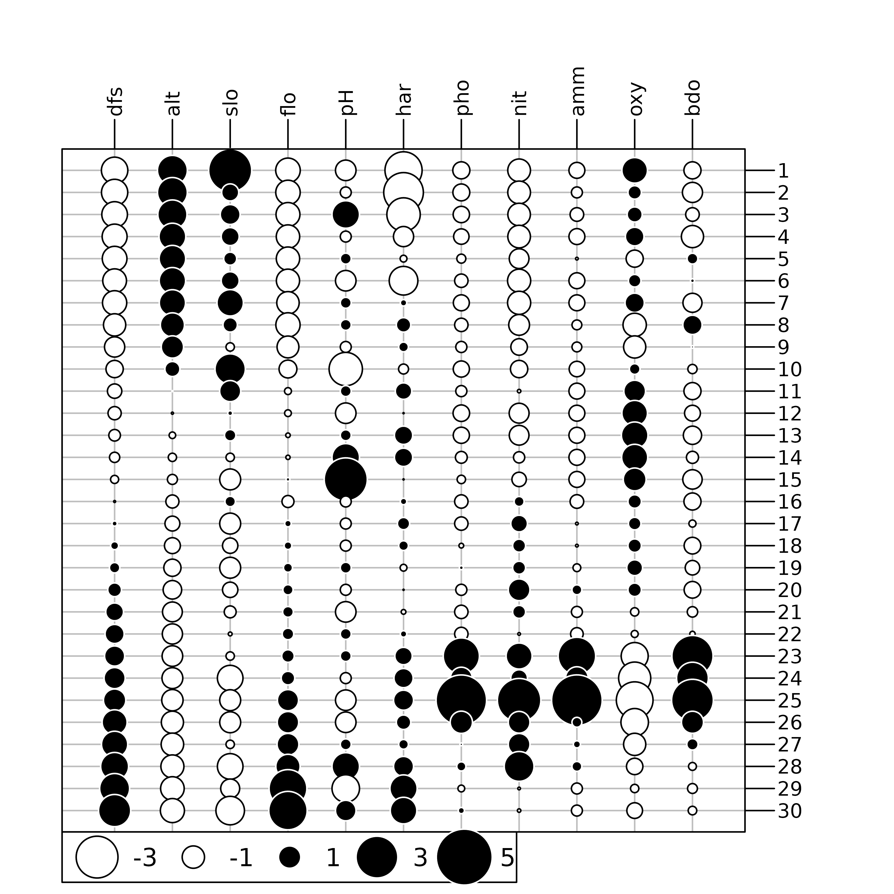
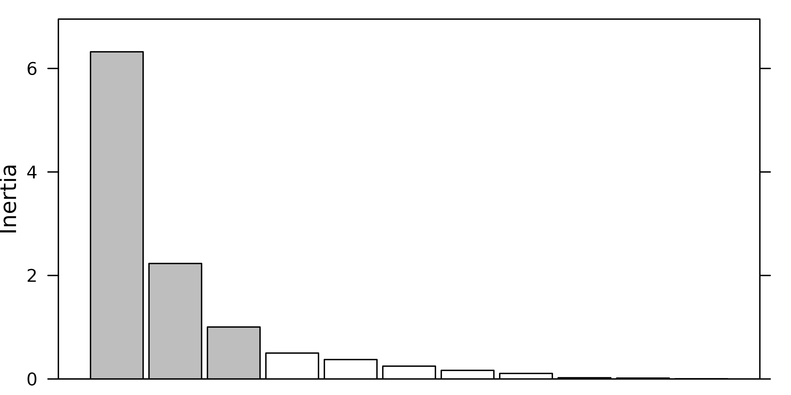
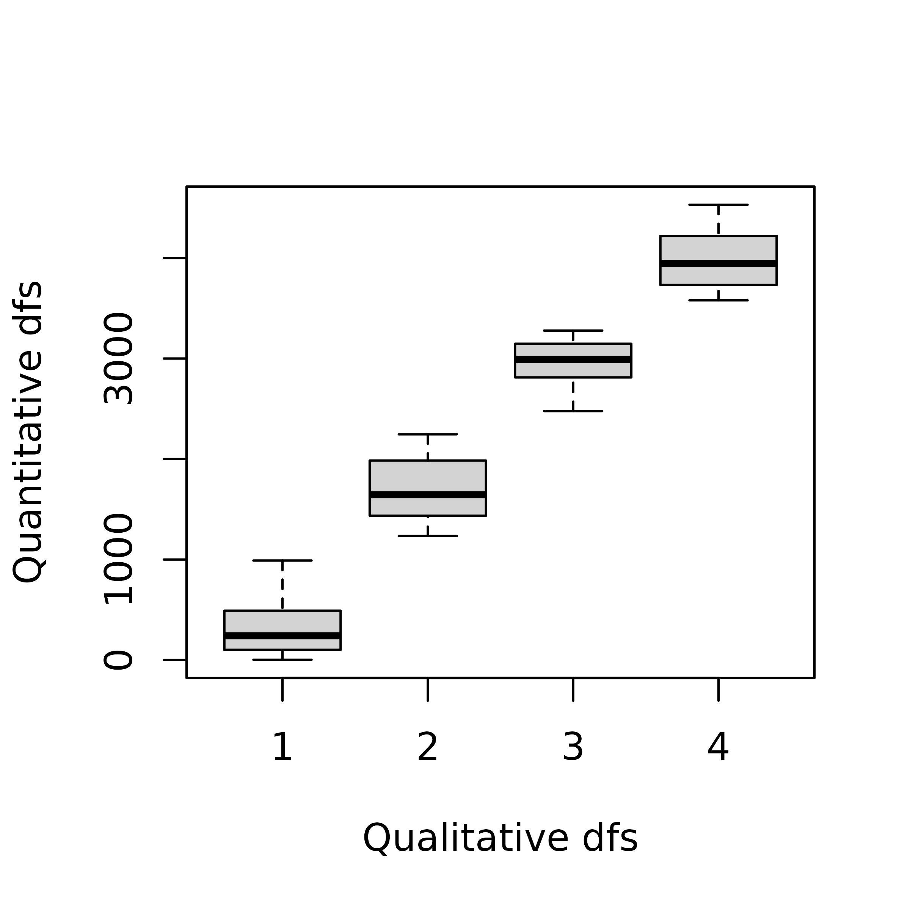
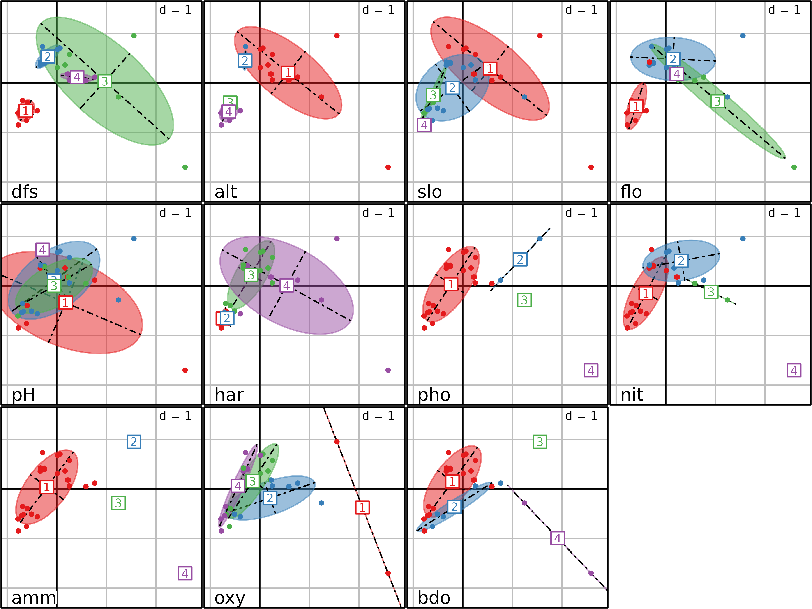

# Description of environmental variables structures

## Abstract

This vignette is about several simple data analysis methods that can be
used to describe the structure of environmental variables tables. Simple
here means that these methods are adapted to the analysis of only one
data table. If more information is available, for example information on
the structure of the table (e.g., groups of rows or of columns), or if
information is contained in more than one data table, then other methods
should be used.

The vignette is organized in three parts, corresponding to three data
analysis methods: *normed PCA* for quantitative variables, *multiple
correspondence analysis (MCA)* for qualitative variables (`factors` in
R), and the *Hill and Smith analysis* for tables containing a mix of
qualitative and quantitative variables.

## Introduction

Several simple data analysis methods can be used to describe the
structure of environmental variables tables. Simple here means that
these methods are adapted to the analysis of only one data table. If
*more information* is available, for example information on the
structure of the table (e.g., groups of rows or of columns), or if
information is contained in *more than one* data table, then other
methods should be used. According to the type of measured variables
(quantitative, qualitative or both), different methods can be
considered.

These different approaches will be illustrated using the `doubs` data
set, from **ade4** (see Verneaux1973 and
`help("doubs", package "ade4")`) . The `doubs$env` data frame contains
eleven environmental variables measured at 30 sites along the Doubs
river in the Jura region (France). The `doubs$fish` data frame contains
the abundances of 27 fish species that were found in the same sites. The
`doubs$xy` data frame contains the spatial coordinates of the 30 sites
(two columns, x and y).

``` r
library(ade4)
library(adegraphics)
data(doubs)
names(doubs)
#> [1] "env"     "fish"    "xy"      "species"
```

``` r
names(doubs$env)
#>  [1] "dfs" "alt" "slo" "flo" "pH"  "har" "pho" "nit" "amm" "oxy" "bdo"
```

The eleven variables are:

1.  `dfs`: distance from the source (km \* 10)
2.  `alt`: altitude (m)
3.  `slo`: log(x + 1) where x is the slope (per mil \* 100)
4.  `flo`: minimum average stream flow (m$^{3}$/s \* 100)
5.  `pH` (\* 10)
6.  `har`: total hardness of water (mg/l of Calcium)
7.  `pho`: phosphates (mg/l \* 100)
8.  `nit`: nitrates (mg/l \* 100)
9.  `amm`: ammonia nitrogen (mg/l \* 100)
10. `oxy`: dissolved oxygen (mg/l \* 10)
11. `bdo`: biological demand for oxygen (mg/l \* 10)

This environmental table can be represented graphically using the
`table.value` or `table.image` function of the **adegraphics** package.
Here the data are represented using the `table.value` function. As the
ranges of variation of the differental environmental variables are quite
different, we scaled the data to allow a common and meaningful graphical
representation:

``` r
env <- doubs$env
apply(env, 2, range)
#>       dfs alt   slo  flo pH har pho nit amm oxy bdo
#> [1,]    3 172 1.099   84 77  40   1  15   0  41  13
#> [2,] 4530 934 6.176 6900 86 110 422 620 180 124 167
```

``` r
table.value(scale(env), symbol = "circle")
```



As the spatial coordinates are also available, sites can be plotted in
the geographical space. The `s.label` function can be used to draw the
position of sites, with the site number as label and with the
`s.traject` to draw lines between sites.

``` r
xy <- doubs$xy
sl1 <- s.label(xy, ppoints.cex = 0, plot = FALSE)
st1 <- s.traject(xy, ppoints.cex = 0, plabels.cex = 0, plot = FALSE)
s1 <- superpose(st1, sl1, plot = TRUE) 
```


To facilitate the interpretation of environmental data, information of
both figures can be combined by creating thematic maps for all
variables. To achieve this, we use the `s.value` function, with
multivariate data in the `z` argument. It automatically loops over the
variables and produces 11 geographical maps presented here. By default,
this function plots squares which size is proportional to a set of
values. The colour of the squares gives the sign of the value (white for
negative values, black for positive). Here, we modify the `method`,
`symbol` and `ppalette.quanti` parameters to obtain figures with
coloured circles.

``` r
mypal <- colorRampPalette(c("#EDF8FB", "#006D2C"))
s.value(xy, doubs$env, pgrid.draw = FALSE, porigin.draw = FALSE, plegend.drawKey = FALSE, 
psub.cex = 2, method = "color", symbol = "circle", ppalette.quanti = mypal, ppoints.cex = 0.5)
```


The maps presented here highlights that some environmental variables
have similar spatial distributions (e.g., distance from the source
(`dfs`) and stream flow (`flo`)). The objective of multivariate methods
is to provide a summary of this environmental table by identifying the
main patterns of variation and which variables are involved in these
structures.

## Standardised Principal Components Analysis (PCA)

Principal Component Analysis (Pearson 1901; Hotelling 1933) is the most
simple and the basis of all multivariate analysis methods. It allows to
summarise the structure of a table containing quantitative variables.
Many theoretical models lead to the same computations, but the duality
diagram (Escoufier 1987) and the geometric model (LeRoux and Rouanet
2004) are the ones used in the **ade4** package. In the **ade4**
package, the `dudi.pca` function is used to compute a PCA, and all the
outputs of this function are grouped in a `dudi` object (subclass
`pca`).

Two types of PCA are generally distinguished: *covariance matrix* PCA
and *correlation matrix* PCA. They can be considered as the same method,
applied after a different treatment of the data table: centring
(subtracting the mean of each variable) for covariance matrix PCA and
standardisation (subtracting the mean and dividing by the standard
deviation) for correlation matrix PCA.

In the case of the `env` data table, the choice between covariance or
correlation matrix PCA is easy: variables are not expressed in the same
units and have very different variances, ranging from 1 to more than
3.106. Here, differences in variances are meaningless and should not be
considered in the analysis. Using a correlation matrix PCA is therefore
necessary to remove these differences.

When all the variables are measured in the same units (homogeneous
tables), both types of PCA can be applied. PCA on covariance matrix
would give more importance to variables with high variance as they
contribute more to the total inertia and thus will have more weight in
the definition of axes. On the other hand, PCA on correlation matrix
will give an equal importance to all the variables so that only the
redundance (i.e., correlations) among variables drives the definition of
axes. To choose between the two possibilities, users must decide if the
differences between variances are (or not) a useful information that
should be taken into account in the analysis. For example, in toxicity
tables, all the values are LD50 (lethal dose 50, i.e., the concentration
that kills 50% of organisms), and the columns correspond to different
chemical compounds instead of different variables. Using a correlation
matrix PCA on these tables will probably remove important information
about the difference in toxicity between chemical compounds or between
the diversity of species. In these cases, a covariance matrix PCA
(argument scale set to FALSE) is preferable.

The PCA of the `doubs$env` table is computed with the `dudi.pca`
function and stored in the `pca1` object:

``` r
pca1 <- dudi.pca(env, scale = TRUE, scannf=FALSE, nf=3)
```

The `scale` argument is set to `TRUE` (the default value), so the PCA
will be computed on the standardised (centred and normed) data table.
The result is therefore a correlation matrix PCA.

The `scannf` argument (“**scan** the **n**umber of **f**actors”) is set
to FALSE, which means that the number of axes should not be asked to the
user, but arbitrarily set to three. This value (three) is given by the
third argument, `nf`. If `nf` is not set explicitly, it defaults to two.
When running in interactive mode, the `scannf` argument should not be
used, and its default value (`TRUE`) will cause the function to ask the
number of axes (principal components) interactively to the user. This is
the number of axes that should be “kept” in output files, and on which
loadings and scores will be computed.

Many methods have been invented to try to guess the number of principal
components that should be kept after a PCA. In **ade4**, users are
simply asked how many components they want. To help answer this
question, `dudi` functions display a barplot of eigenvalues in
decreasing order. The user should then try to find a discontinuity in
the shape of the decrease, and choose to keep the axes corresponding to
eigenvalues placed before (on the left of) this discontinuity.

For example, in the following figure, the user should keep (from left to
right) 2, 3 and 4 axes.


Of course these examples are quite caricatural, and in real situations,
it can be much harder to choose an appropriate number of principal
components. However the principle remains that the shape of the decrease
of eigenvalues is a good indicator of the presence of structures in the
data table. Trying to keep the axes that correspond to these potentially
interesting structures is therefore a good and easy-to-use rule. As an
alternative, the procedure developed by Dray (2008) is implemented in
the `testdim` function that can be applied on correlation matrix PCA
created by the `dudi.pca` function with `scale = TRUE`.

``` r
testdim(pca1)$nb.cor
#> [1] 2
```

The next figure shows the barplot of `pca1` eigenvalues. Three principal
components were kept (although the `testdim` procedure said two).

``` r
screeplot(pca1, main=" ", xlab=" ")
```



The correlation circle of the variables (left) and the factor map of
sites (right) on the first two principal components are shown in the
next figure.

``` r
sc1 <- s.corcircle(pca1$co, plot = FALSE)
sl1 <- s.label(pca1$li, plabels.optim = TRUE, ppoints.cex = 0.5, plot = FALSE)
ADEgS(list(sc1, sl1))
```


This correlation circle (`sc1` object) shows two nearly orthogonal
gradients: a geomorphological gradient opposing altitude and slope to
hardness, distance from the source and stream flow, and a chemical
gradient, opposing dissolved oxygen to phosphates, ammonium, and
biological demand for oxygen. Oxygen concentration is higher upstream,
and pollution is higher downstream, so these two gradients are not
completely orthogonal. The first principal component is an
upstream-downstream gradient, while the second component opposes
geomorphology to chemical processes.

The factor map on the right (`sl1` object) shows that the sites are
ordered along the first principal component, from site 1 (upstream, 300
m from the source) to site 30 (downstream, 453 km from the source).
Departures from this geomorphology gradient are explained by the
chemical gradient: sites with a high concentration of oxygen (1, 4, 7,
11, 12, 13, 14, 15) are in the lower-left part of the graph, and sites
with a high concentration of ammonium, phosphates and a high BDO (23,
24, 25) are in the upper-right part of the graph.

The site coordinates can also be used to draw geographical maps of site
scores, using the `s.value` function. This next figure shows the map of
site scores on the first two principal components. The first principal
component (left) is clearly an upstream-downstream gradient, with the
exception of sites 23 to 25 (see site numbers in previous figure). The
second principal component (right) cuts this gradient in four parts: the
upper stream (sites 1 to 22) is divided in two, according to altitude
and slope, and the lower stream (sites 23 to 30) is divided according to
the pollution variables (ammonium, phosphates and BDO) which are higher
in sites 23 to 26 and lower in sites 27 to 30.

``` r
s.value(xy, pca1$li[, 1:2], pgrid.draw = FALSE, porigin.draw = FALSE, method = "size",
symbol = "circle", col = mypal(2), ppoints.cex = 1)
```


The upstream-downstream gradients and the particular characteristics of
highly polluted sites (sites 23 to 26) or of sites with high oxygen
concentration (11 to 15) appear very clearly on these maps.

More generally, the geographical maps of site scores and their
comparison with the collection of maps of standardised variables can be
very useful to help interpret the outputs of a PCA. Drawing these maps
is not possible when there are hundreds of variables (as it is the case
for DNA fingerprints, for example), but then, particular variables of
interest (e.g., variables with the most important relative
contributions, see Box 3.3) can be chosen and mapped.

## Multiple Correspondence Analysis (MCA)

Multiple Correspondence Analysis (MCA) is the basic method to analyse
tables of qualitative variables (see the synthesis by Tenenhaus1985)
that are stored as `factors` in **R**. We illustrate MCA with the same
data set, but we obtain qualitative variables by spliting the
quantitative variables into categories. Four categories are defined
automatically for each variable using the `cut` function. This function
is applied to the environmental variables with the `apply` function, and
the resulting qualitative variables are stored in the `fenv` data frame.

``` r
fenv <- apply(env, 2, cut, breaks = 4, labels = 1:4)
fenv <- as.data.frame(fenv, stringsAsFactors = TRUE)
```

This transformation induces a loss of information as different values
for a quantitative variable are regrouped into a single category of the
recoded qualitative variable. However, this approach can be useful when
non-linear relationships occur between variables. In this case, PCA
which is based on correlations, will only be able to extract linear
relationships wherears MCA can identify non-linear trends by reordering
the categories. When the relationships between variables are (at least
approximately) linear, the results of both methods should be comparable.

``` r
plot(env[, 1] ~ fenv[, 1], ylab = "Quantitative dfs", xlab = "Qualitative dfs")
```



MCA allows to identify associations between the categories (`levels`) of
different qualitative variables (`factor`). The method is implemented in
the `dudi.acm` function of the **ade4** package. All the outputs of this
function are grouped in a `dudi` object (subclass `acm`). Here, we
applied MCA on the data frame `fenv`.

``` r
acm1 <- dudi.acm(fenv, scannf = FALSE)
screeplot(acm1, main = " ", xlab = " ")
```


The main difference between PCA and MCA is that the columns of the
analysed table are the variables in PCA but the categories of
qualitative variables in MCA:

``` r
ncol(pca1$tab)
#> [1] 11
```

``` r
ncol(acm1$tab)
#> [1] 44
```

The categories correspond to the different columns in the disjunctive
table analysed by the MCA which means that their order is not taken into
account, just like different variables in a PCA. As a consequence, the
number of eigenvalues is also increased in MCA. Another important
difference is that MCA weights columns proportionally to the number of
individuals belonging to the categories so that all variables have the
same weights (as in PCA):

``` r
acm1$cw[1:4] == table(fenv$dfs)/nrow(fenv)/ncol(fenv)
#> 
#>    1    2    3    4 
#> TRUE TRUE TRUE TRUE
```

``` r
as.numeric(by(acm1$cw, rep(1:ncol(fenv), each = 4), sum)) * ncol(fenv)
#>  [1] 1 1 1 1 1 1 1 1 1 1 1
```

The next figure shows that, except for an inversion of the sign of the
second axis, the factor map of sites is still very similar to the factor
map obtained by the PCA. The same typology of sampling sites along the
stream is found: upper-stream sites (`1` to `10`) with high oxygen
concentration and low ammonium and BDO are opposed to lower-stream sites
(`26` to `30`), with sites `23` to `25` having an exceptionally high
level of pollution.

``` r
sl1 <- s.label(acm1$co, ppoints.cex = 0.5, plabels.optim = TRUE, plot = FALSE)
sl2 <- s.label(acm1$li, ppoints.cex = 0.5, plabels.optim = TRUE, plot = FALSE)
ADEgS(list(sl1, sl2))
```


The graph of categories (left) is somewhat different because we now have
one point for each category of each qualitative variable (44 categories
as a whole) instead of 11 points only. The interpretation is however the
same: categories corresponding to high levels of ammonium and BDO
(`amm.4`, `bdo.4`) and to low levels of oxygen (`oxy.1`) are on the
right of the graph, where highly polluted sites are found. Conversely,
categories corresponding to high levels of oxygen (`oxy.4`), high values
of slope (`slo.4`), low values of flow (`flo.1`) and hardness (`hard.1`,
`hard.2`) are located on the left of the graph, where upper-stream sites
are found.

MCA allows to carry out the interpretation of factors at the level of
categories. This means that one can get a better (finer) explanation of
the meaning of factors. In the **ade4** package, this property is used
to draw particular graphs that show which individuals belong to each
category. Two types of graphs can be drawn, using functions `score` and
`plot`.

The first type of graph (using the `score` function) shows the results
of MCA for a given axis (specified by the `xax` argument which is equal
to 1 by default). The normed coordinates of all the individuals
(`acm1$l1`) are placed along the x-axis and the categories are displayed
at the mean of the coordinates of their individuals. The vertical
coordinate is given by the category score (`acm1$co`). It is then easy
to interpret the meaning of the factor by looking at the positions of
categories and individuals. For example, on this figure, one can see
that the categories of variables hardness, phosphorus, nitrates,
ammonium and BDO are ordered by increasing values along the first MCA
factor.

``` r
score(acm1, type = "points", col = TRUE, psub.cex = 1.5)
```


Conversely, the categories of variables altitude, slope, oxygen are
ordered by decreasing values along the first MCA factor. On the vertical
axis, the intervals between labels give information of the differences
among categories (variance between categories). On the horizontal axis,
the spacing among the tick marks allows to evaluate the homogeneity of
individuals in a category (variance within categories). As the
individual scores in MCA (`acm1$l1`) maximise the mean correlation ratio
for all the qualitative variables, it is expected that the more vertical
is the regression line for a qualitative variable, the higher is its
correlation ratio value.

Correlation ratios are stored in `acm1$cr`:

``` r
acm1$cr
#>            RS1        RS2
#> dfs 0.65016681 0.54171843
#> alt 0.54859870 0.46823722
#> slo 0.36285735 0.18818923
#> flo 0.52994726 0.57221033
#> pH  0.02395703 0.15608652
#> har 0.37615802 0.26756014
#> pho 0.75418361 0.33688896
#> nit 0.73983937 0.53046062
#> amm 0.71443072 0.36912488
#> oxy 0.67303617 0.07847305
#> bdo 0.65985629 0.38952981
```

The second type of graph is shown in the next figure. It can be drawn
using the `plot` function. It is a bidimensional plot, with two MCA axes
as abscissae and ordinates (specified by the `xax` and `yax` arguments,
with default values equal to 1 and 2 respectively). Each category of
each variable is displayed by an ellipse. The position of the center of
the ellipse is given by the means of the coordinates of the individuals
(`$li`) belonging to the category. The width and height of an ellipse
are given by the variance of the coordinates of the individuals, and the
covariance between the coordinates on the two axes gives the slope of
the ellipse. The interpretation of this figure is the same as the
previous one, but it is much more easy and detailed, as the categories
of all the variables are not superimposed.

``` r
plot(acm1, col = TRUE, psub.cex = 1.5)
```



## Hill and Smith analysis

Environmental data sets with exclusively qualitative variables are not
very frequent. Some variables are easy to measure automatically on a
continuous scale, while others are intrinsically qualitative. So the
most frequent case is a table containing a mix of qualitative and
quantitative variables. In this case, one can choose between two
strategies: transforming quantitative variables to qualitative ones and
using MCA, or considering qualitative variables as quantitative ones and
using PCA.

The first strategy can be used when the number quantitative variables is
low. If this is not the case (most variables are quantitative with just
a few qualitative ones), the loss of information may badly influence the
results of the data analysis procedure. The second strategy can be used
when qualitative variables are in fact ordered qualitative variables
(e.g., categories *low*}, *medium* and *high*). In this case, using PCA
can be relevant (if linear trends are expected) but it is not a viable
solution when qualitative variables contains categories that cannot be
oredered (e.g., `blue`, `red` and `green`).

The Hill and Smith Analysis (HillSmith76) is a data analysis method that
is able to deal directly with a data table containing a mix of
quantitative and (ordered or unordered) qualitative variables. This
method does not modify the original characteristics of the variables,
avoiding the arbitrary choices of the two previous strategies. If all
the variables are quantitative, then the results of HSA are identical to
those of PCA. If all the variables are qualitative, then the results are
identical to those of MCA. And if there is a mix of $p$ quantitative
variables and $q$ qualitative variables, then the analysis is an optimal
combination of the properties of the two analyses.

The row weights of this analysis are the same as the row weights of the
PCA of the *p* quantitative variables, and are also equal to the row
weights of the MCA of the *q* qualitative variables. The column weights
are different: for quantitative variables, column weights are equal to
*1/(p+q)*, instead of 1 in a PCA. For qualitative variables, the weights
are computed as in MCA (sum of the weights of the individuals belonging
to each category, divided by *q*), except that it is divided here by the
total number of variables (*p+q*) instead of *q*. The total sum of
column weights is therefore equal to 1, and qualitative and quantitative
variables have the same weights.

To illustrate HSA, we consider the Doubs data where the first six
variables are considered as qualitative and the last five as
quantitative:

``` r
menv <- cbind(fenv[, 1:6], env[, 7:11])
```

The Hill and Smith Analysis is then computed on the resulting table
using the `dudi.hillsmith` function of the **ade4** package. The
`scatter` function can then be used to draw the biplot, where
quantitative variables appear as simple labels, while qualitative ones
appear with one label for each category.

``` r
hs1 <- dudi.hillsmith(menv, scannf = FALSE)
scatter(hs1, posieig = "bottomleft")
```


The `score` function can also be used to highlight the properties of the
method. HSA maximises the squared correlation for quantitative variables
(*i.e.*, the criteria of PCA) and the correlation ratio for qualitative
variables (*i.e.*, the criteria of MCA). As consequence, the next figure
can be interpreted as the previous one for quantitative variables and
for qualitative variables.

``` r
score(hs1, col = TRUE)
```


These values are also stored in `hs1$cr`:

``` r
hs1$cr
#>            RS1         RS2
#> dfs 0.70221662 0.840069215
#> alt 0.65252421 0.741725649
#> slo 0.41025629 0.157049355
#> flo 0.63964656 0.633380517
#> pH  0.02332208 0.225874627
#> har 0.42895368 0.320769976
#> pho 0.75512094 0.046148513
#> nit 0.85903395 0.008401339
#> amm 0.70428031 0.069365094
#> oxy 0.61287111 0.202631179
#> bdo 0.63869975 0.126526651
```

## Other simple methods

The **ade4** package provides other methods for the analysis of an
environmental table, but we are not going to detail them here. Here is
the list of the functions and the corresponding methods (see the online
documentation for more information on how to use them and examples of
application):

- `dudi.fca`: Fuzzy Correspondence Analysis. Fuzzy variables are a
  generalisation of categorical variables, where items have a given
  probability of belonging to the categories of each fuzzy variable.
- `dudi.fpca`: Fuzzy PCA (see above)
- `dudi.mix`: Mixed type Analysis. This is an alternative to the
  `dudi.hillsmith` function.

.
