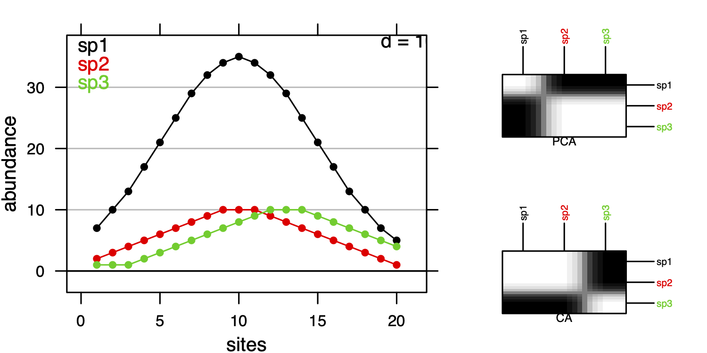
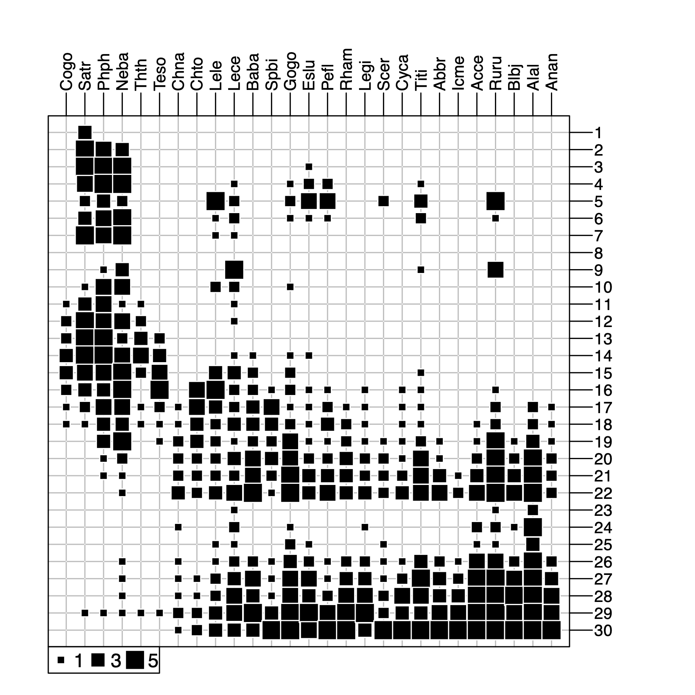
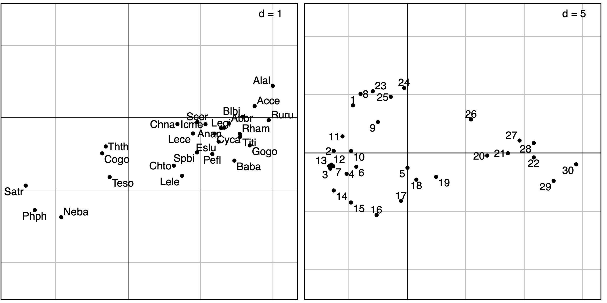
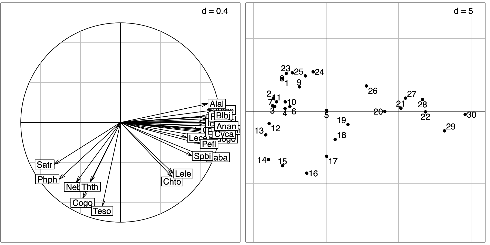
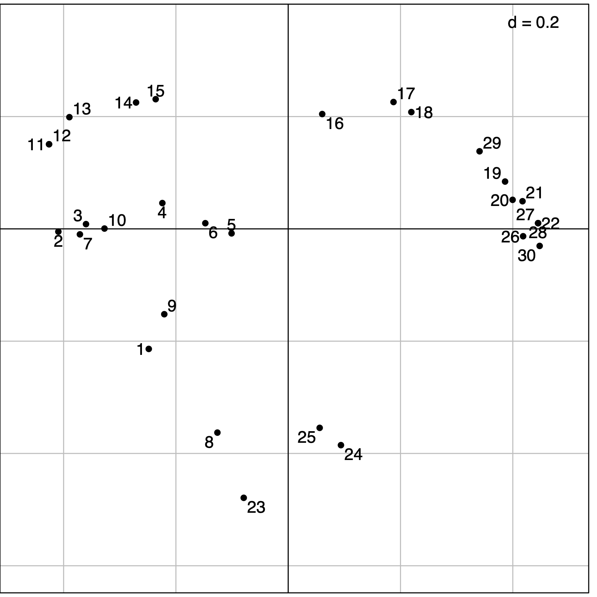

## Abstract

Several simple data analysis methods can be used to analyse species data tables, i.e., tables having sites as rows and species as columns. Like in the previous vignette, simple means that these methods are adapted to the analysis of only one table. Three particular data analysis methods will be studied here: Correspondence Analysis (CA), centred Principal Component Analysis (cPCA), and Principal Coordinate Analysis (PCoA).

## Introduction

Community ecology aims to study patterns and processes underlying the coexistence of individuals of different species (species assemblage).
To achieve this goal, field works are performed to describe several sites by their species compositions (e.g., abundance, presence-absence). 
This information is stored as a sites &#xd7; species table that can be graphically represented (Figure 1). 
Following the continuum theory of (Gleason1926), a common approach (McIntosh1978) consisted in rearranging the sequence of sites and species, both horizontally and vertically, to highlight the main organisation of ecological communities (Figure 1). 
In the final arrangement, sites (respectively species) are ordered so that the position of a given site (respectively species) should reflect its similarity with others. 

`library(ade4)`  
`library(adegraphics)`  
`data(dunedata)`  
`afc1 <- dudi.coa(dunedata$veg, scannf = FALSE)`  
`g1 <- table.value(dunedata$veg, symbol = "circle", ppoints.cex = 0.5, plot = FALSE)`  
`g2 <- table.value(dunedata$veg, coordsx = rank(afc1$co[,1]),`  
`coordsy = rank(afc1$li[,1]), symbol = "circle", ppoints.cex = 0.5, plot = FALSE)`  
`cbindADEg(g1, g2, plot = TRUE)`  

<figcaption align = "center">
Fig.1 - Graphical representation of a floristic table (columns correspond to 30 species, rows to 20 sites). The size of symbols is proportional to species abundance. On the right, rows and columns are reordered using Correspondence Analysis to highlight the main structure. Data available in the dataset `dunedata` in **ade4**.
</figcaption>

In the first works, the rearrangement is performed by hand (Curtis1951) and the result is often subjective, depending on the experience of the ecologist. 
Hence, several methods have been proposed to perform an objective ordering of sites and species. 
(Goodall1954) proposed the generic term *ordination* to describe any techniques that allow to rearrange an ecological table. 
He suggested that this ordination can be performed on several dimensions and used Principal Component Analysis (PCA) to analyse a floristic data set. 
PCA has been widely used by ecologists but also strongly criticised due to its underlying assumption of linear species responses which is inadequate in the context of gradient analysis (Swan1970, Austin1971, Beals1973).
Based on the principle of weighted averaging, Correspondence Analysis (CA) considers unimodal species responses. 
This method developed by (Benzecri1969) has been popularised by Hill1974, Hill1973 in Ecology using the iterative algorithm of *reciprocal averaging*. 
CA uses the $\chi^2$ distance in a symmetric manner for sites and species. 
If the study mainly aims to characterise the variations of diversity among sites (i.e., $\beta$ diversity), other types of distance can be envisaged. 
In this case, the analysis focuses on the similarities between sites and Principal Coordinate Analysis (PCoA) can be applied to summarise the information in few dimensions. 

This vignette shows how the choice of a data analysis method should be driven by the type of data (count tables, presence-absence, abundance indices, etc.) but also by the objectives of the study. Indeed, each method has its own mathematical properties, and these properties relate to an underlying ecological model that must be adapted to the objectives of the study. 

## Correspondence Analysis (CA)

Correspondence analysis (CA) is designed to analyse two-way contingency tables. 
These tables contain counts of individuals belonging to categories of two categorical variables. 
In **R**, the `table` function allows to build such table by crossing two `factor` objects.
For instance, the frequency distribution of 70 species (from the `carniherbi49` data set of **ade4**) according to their order and diet is obtained by:

`library(ade4)`  
`data(carniherbi49)`  
`(tab <- table(carniherbi49$taxo$ord, carniherbi49$tab2$clade))`  
`.              Carnivore Herbivore`  
`Artiodactyla           0        24`  
`Carnivora             19         0`  
`Perissodactyla         0         6`  

By definition, a contingency table contains only positive values and its rows and columns play the same role as they both correspond to categories. It is possible to compute marginal (i.e., by row and column) and grand totals:

`rowSums(tab)`  
`Artiodactyla      Carnivora Perissodactyla `  
`.         24             19              6 `  

`colSums(tab)`  
`Carnivore Herbivore `  
`.      19        30 `  

`sum(tab)`  
`[1] 49`  

The association between the two categorical variables can be evaluated by a $\chi^2$ test. The statistics of this test measures the deviation between observed counts and those expected under the hypothesis of independence between the two variables. Here, we used a randomisation version of the test: 

`chisq.test(tab, simulate.p.value = TRUE)`  
`	Pearson's Chi-squared test with simulated p-value (based on 2000 replicates)`  
`data:  tab`  
`X-squared = 49, df = NA, p-value = 5e-04`  

A sites $\times$ species table is not a contingency table *sensu stricto* as the sampling unit is the site. However, it can be treated as a contingency table by considering that individuals have been sampled and two categorical variables (namely the species and the site) have been measured. This would correspond to sample a number of individuals so that the list of species is simply the result of the exploration of the biological diversity of the environment, and the list of sites is simply the result of the exploration of the spatial extent of the study area. 

We considered the `doubs` data set (see the vignette on Environmental variables structures). In this data set, the `doubs$fish` data frame contains the number of fish of 27 species that were found in the 30 sites along the Doubs river. In this case, summing values by row, columns or both makes sense as it produces the number of fishes sampled in each site, the number of fishes for each species and the total number of fishes:  

`data(doubs)`  
`fish <- doubs$fish`  
`rowSums(fish)`  
` 1  2  3  4  5  6  7  8  9 10 11 12 13 14 15 16 17 18 19 20 21 22 23 `  
` 3 12 16 21 34 21 16  0 14 14 11 18 19 28 33 40 44 42 46 56 62 72  4 `  
`24 25 26 27 28 29 30 `  
`15 11 43 63 70 87 89 `  

`colSums(fish)`  
`Cogo Satr Phph Neba Thth Teso Chna Chto Lele Lece Baba Spbi Gogo Eslu `  
`  15   57   68   73   15   19   18   26   43   56   43   27   55   40 `  
`Pefl Rham Legi Scer Cyca Titi Abbr Icme Acce Ruru Blbj Alal Anan `  
`  36   33   29   21   25   45   26   18   38   63   31   57   27 `  

`sum(fish)`  
`[1] 1004`  

Several books were dedicated to CA, see for example (Nishisato1980) and (Greenacre1984). 
In **ade4**, CA is computed with the `dudi.coa` function.
The first argument of this function is the data frame containing species counts.
Additional arguments `scannf` and `nf` work as in the `dudi.pca` function to choose the number of axes on which scores and loadings are computed (see Section \ref{examplePCA}).
All the outputs of this function are grouped in a `dudi` object (subclass `coa`).

`coa1 <- dudi.coa(fish, scannf = FALSE, nf = 2)`  

Correspondence Analysis allows to summarise the structure of a contingency table by identifying associations between categories of both variables (sites and species). The initial data transformation for a CA is different from the transformation used for a PCA (centring and standardisation). In CA, counts are first transformed into frequencies. These frequencies are then turned into relative frequencies, dividing them by marginal frequencies, and they are finally centred. This transformation means that CA is based on relative composition (for both species and sites) so that quantitative differences are removed contary to PCA that works on abundance values. This difference is illustrated with a simulated data set where the abundance of 3 species are generated for sites using a Gaussian response model. Curves for species 1 and species 2 differ only by their maximum abundance whereas curves for species 2 and 3 differ only for the niche position. 

`fgauss <- function(x = 1:20, mu, t, h) h * exp(-(x - mu)^2/(2 * t^2))`  
`sp1 <- fgauss(mu = 10, t = 5, h = 35)`  
`sp2 <- fgauss(mu = 10, t = 5, h = 10)`  
`sp3 <- fgauss(mu = 13, t = 5, h = 10)`  
`sim <- round(cbind(sp1, sp2, sp3))`  

PCA and CA are applied on this simulated data set and distances among species are then computed on data transformed by these two methods. 

`dpca <- dist.dudi(dudi.pca(sim, scale = FALSE, scannf = FALSE), amongrow = FALSE)`  
`dcoa <- dist.dudi(dudi.coa(sim, scannf = FALSE), amongrow = FALSE)`  
`g1 <- s1d.curves(sim, p1d.hori = FALSE, paxes.draw = TRUE, `  
`      plines.col = 1:3, ppoints.col = 1:3, xlab = "sites", `  
`      ylab = "abundance", key = list(space = "inside", `  
`          text = list(lab = colnames(sim), col = 1:3)), `  
`      plot = FALSE)`  
`g2 <- table.image(dpca, axis.text = list(col = 1:3), `  
`      xlab = "PCA", plot = FALSE)`  
`g3 <- table.image(dcoa, axis.text = list(col = 1:3), `  
`      xlab = "CA", plot = FALSE)`  

`ADEgS(list(g1, g2, g3), layout = matrix(c(rep(1, 4), 2, 3), 2))`  

<figcaption align = "center">
Fig.2 - Simulation of the response curves of 3 species for 20 sites. On the right, distances among species are computed in the case of PCA or CA and represented by heatmaps. Black cells correspond to high distances, white cells to low distances.
</figcaption>

In PCA, species 2 and 3 are the closest as their absolute abundances in sites are similar (Figure 2). In CA, the values themselves have no influence, it is the shape of the profiles that matters. Hence, species 1 and 2 are the closest as they have the same niche positions. Hence, CA should be used only when the study should focus on relative composition and not consider difference in abundance. This is the case in gradient analysis where species should be ordered by their niche positions on an environmental or a latent gradient.

The same rationale holds for sites. We consider 3 sites of the simulated data set:

`sim3 <- sim[c(1, 10, 20), ]`  
`rownames(sim3) <- c(1, 10, 20)`  
`sim3`  
`.  sp1 sp2 sp3`  
`1    7   2   1`  
`10  35  10   8`  
`20   5   1   4`  

When PCA is applied, absolute abundances are considered and site 1 is thus more similar to site 20 than to site 10:

`dist.dudi(dudi.pca(sim3, scale = FALSE, scannf = FALSE))`  
`.       1     10`  
`10 29.950       `  
`20  3.742 31.575`  

On the other hand, site 1 is much more similar to site 10 than to site 20 when CA is applied:

`dist.dudi(dudi.coa(sim3, scannf = FALSE))`  
`.       1     10`  
`10 0.1332       `  
`20 0.7897 0.6576`  

These patterns are due to the fact that CA works on relative compositions and the high proportion of species 1 in sites 1 and 10 (around 70\% of the individuals) explains the high level of similarity between these two sites:

`prop.table(sim3, 1)`  
`.     sp1    sp2    sp3`  
`1  0.7000 0.2000 0.1000`  
`10 0.6604 0.1887 0.1509`  
`20 0.5000 0.1000 0.4000`  

These differences between PCA and CA are due to different parametrisation for data transformation (`$tab`), sites (`$lw`) and species weights (`$cw`) which imply different ways to compute distances among sites: CA uses the $\chi^2$ distance whereas PCA is based on Euclidean distance.

Lastly, note that CA is a symmetric method, while PCA is intrinsically asymmetric. In PCA, rows and columns play a very different role: columns are variables and rows are observations. The PCA of a table and the PCA of the transpose of this table give very different results \citep[see for example R-mode and Q-mode PCA,][]{legendre98}. Conversely, rows and columns have the same role in CA, and the CA of the transpose of a table gives exactly the same results as the CA of the table itself. This means that, \emph{a priori}, CA should be used on tables where rows and columns play the same role.

Figure 3 shows the first two axes factor maps of CA applied on the `doubs$fish` data set. Fish species (left) and sampling sites (right) positions are drawn with the `s.label` function.

`sl1 <- s.label(coa1$co, plabels.optim = TRUE, ppoints.cex = 0.5, plot = FALSE)`  
`sl2 <- s.label(coa1$li, plabels.optim = TRUE, ppoints.cex = 0.5, plot = FALSE)`  
`ADEgS(list(sl1, sl2))`  

<figcaption align = "center">
Fig.3 - Correspondence Analysis of the Doubs fish species data table. Left: fish species factor map, right: sampling sites factor map.
</figcaption>

The fish species factor map (Figure 3, left) shows very clearly that three zones can be distinguished along the stream.
The first one is the trout zone (lower left corner), where the most frequent species are brown trout (`Satr`), minnow (`Phph`) and stone loach (`Neba`).
The second one is the grayling zone (upper left corner), where grayling (`Thth`), blageon (`Teso`) and european bullhead (`Cogo`) are also present, while the first three species are decreasing. 
The last one (on the right of the figure) is the downstream zone, where all other species are present.

The sites factor map shows (Figure 3, right) the sites that belong to the three zones. The trout zone extends from site `1` to site `10` (with the exception of site `8`), the grayling zone goes from site `11` to site `18`, and all other sites belong to the downstream zone. This typology is in good agreement with what is known about the biology of these species in this region (Verneaux1973) and with the Huet zonation.

There is however a problem with the results of this CA: the high pollution peak that was detected at sites `23` to `26` by the PCA of water physico-chemical parameters does not seem to have any effect on fish species distribution. This is strange, as many fish species are very sensitive to water pollution.

And indeed, looking at the raw fish counts (Figure 4) shows that the effect of this pollution on fish numbers is obvious.

`table.value(fish, ppoints.cex = 0.5)`  

<figcaption align = "center">
Fig.4 - Number of fish of the 27 species (columns) found in the 30 sites (rows) of the `doubs` data set. The area of black squares is proportional to the number of fishes.
</figcaption>

Figure 4 was drawn using the `table.value` function. This function plots the whole data table, with black squares proportional to the number of fishes (27 species in columns and 30 sites in row). The trout zone and the grayling zone are clearly visible on the left of the figure, but the downstream zone is obviously cut in two parts, just after site `22`. At site `23`, all species show a dramatic decrease, with only three species still present: `Lece` (chub), `Ruru` (roach) and `Alal` (bleak). This effect of pollution persists along sites `24` to `26`. Fish numbers increase downstream, as the stream restoration process takes place and pollution slowly disappears. As CA considers relative and not absolute abundances, the decrease of abundances due to pollution can not be identified with this method.

Biplot can be produced for CA using the `biplot` or `scatter` functions. In **ade4**, three types of biplots can be produced using the argument `method` (Oksanen1987). If `method = 2`, species are positioned by a unit-variance score (`$c1`) and sites by weighted averaging (`$li`). If `method = 3`, sites are positioned by a unit-variance score (`$l1`) and species by weighted averaging (`$co`). Figure 5 illustrates this representation. By default, (`method = 1`) corresponds to a compromise between these two representations (`$li` and `$co`).  

`sc1 <- scatter(coa1, method = 3, posieig = "none", plot = FALSE)`  
`sv1 <- s.value(coa1$l1, fish[, 5], col = 1:2, plegend.drawKey = FALSE, `  
`      symbol = "circle", centerpar = TRUE)`  
`sd1 <- s.distri(coa1$l1, fish[, 5, drop = FALSE], col = "red", `  
`      ellipseSize = 0, ppoints.cex = 0, plot = FALSE)`  
`cbindADEg(sc1, sv1 + sd1, plot = TRUE)`  

<figcaption align = "center">
Fig.5 - CA of Doubs fish data table. Left: CA biplot (\code{method = 3}) where sites are positioned by a unit-variance score (`$l1`) and species by weighted averaging (`$co`). Right: principles of weighted averaging illustrated for the grayling (`Thth`). Sites are represented using the `s.value` function with symbols proportional to the abundance of grayling. The positions are given by `$l1`. Then, the function `s.distri` is used to position the grayling by weighted averaging. The species is represented by a star linking the species to all the sites where it occurs.
</figcaption>

## Centred PCA (cPCA)

CA outputs do not show the effect of the pollution peak on fishes and the loss of almost all species. This is because CA works on profiles, and therefore removes quantitative differences between sites and between species. CA compares the shape of the profiles, which means that sites (or species) with different fish numbers but with the same profile shape will seem identical. Pollution, by killing almost all the fishes indistinctly has no influence on the shape of the profiles, since all the species are affected in the same way.

If a quantitative effect must be evidenced, then a PCA should be used instead. However, as explained in vignette Environmental variables structures, the difference of variance between species should not be removed, which means that a covariance matrix PCA (also called "centred PCA") should be preferred to a correlation matrix PCA.

`cpca <- dudi.pca(fish, scale = FALSE, scannf = FALSE, nf = 2)`  
`sl1 <- s.label(cpca$co, plabels.optim = TRUE, plot = FALSE)`  
`sl2 <- s.label(cpca$li, plabels.optim = TRUE, plot = FALSE)`  
`ADEgS(list(sl1, sl2))`  

<figcaption align = "center">
Fig.6 - Centred PCA of Doubs fish data table. Left: fish species factor map, right: sites factor map.
</figcaption>

Figure 6 shows the results of a covariance matrix PCA on the fish count table. The species factor map shows that the three zones (trout, grayling and downstream) are still detected and ordered on the first principal component from left to right. On the sites factor map, downstream sites are on the right, with the exception of sites `23`, `24` and `25`, which are on the left, near sites `1` and `8`. What is the common point between sites `1`, `8`, and `23`, `24`, `25` ? It is simply a very low number of fishes, or even the absence of any fish in site `8` (see Figure 7).

`plot(rowSums(doubs$fish), xlab = "Sites", ylab = "Fish number")`  

<figcaption align = "center">
Fig.7 - Total number of fishes in the 30 sites of the `doubs$env` data set.
</figcaption>

## Standardised and non-centred PCA

The choice of centring and standardisation in PCA is very important, and the corresponding analyses can give very different results. Restricting the choice to the usual dichotomy "same units $\Rightarrow$ covariance matrix PCA" and "different units $\Rightarrow$ correlation matrix PCA" can be inadequate. There are other types of centring and standardisation: non-centred PCA, de-centred PCA, block-standardised PCA, etc., that can prove very useful.

Figures 8 and 9 show the differences between a correlation matrix PCA (also called "standardised PCA") and a non-centred PCA (ncPCA) on the Doubs fish counts table.

`pca <- dudi.pca(fish, scannf = FALSE, nf = 2)`  
`sc1 <- s.corcircle(pca$co, plot = FALSE)`  
`sl1 <- s.label(pca$li, plabels.optim = TRUE, plot = FALSE)`  
`ADEgS(list(sc1, sl1))`  

<figcaption align = "center">
Fig.8 - Normed PCA of Doubs fish data table. Left: fish species correlation circle, right: sites factor map.
</figcaption>

`ncpca <- dudi.pca(fish, scale = FALSE, center = FALSE, scannf = FALSE)`  
`sl1 <- s.label(ncpca$co, plabels.optim = TRUE, plot = FALSE)`  
`sl2 <- s.label(ncpca$li, plabels.optim = TRUE, plot = FALSE)`  
`ADEgS(list(sl1, sl2))`  

<figcaption align = "center">
Fig.9 - Non-centred PCA of Doubs fish data table. Left: fish species factor map, right: sites factor map.
</figcaption>

The sites factor map of the normed PCA (Figure 8, right) is very similar to the sites factor map of the centred PCA. But the correlation circle of the normed PCA shows that the standardisation has almost completely removed the distinction between the trout zone and the grayling zone. All the species have been rescaled to unit variance, and some important information about species distribution has been lost. In this analysis, all the species have equal importance. In centred PCA, on the other hand, species with high variations of abundance (and thus high variance) would have more importance than species with low variation of abundances.

Conversely, the non-centred PCA (ncPCA) keeps the distinction between the two zones, and puts the empty site (`8`) at the origin (0, 0) on Figure 9 (just like CA). In centred PCA, the origin corresponds to the average composition of the study area.

This example illustrates the fact that the choice of a data analysis method should not be based only on the type of data. The usual shortcuts "quantitative variables $\Rightarrow$ PCA" and "count tables $\Rightarrow$ CA" may lead to very bad results. PCA and CA are very different methods that should be used with caution. The choice must be based on the adequacy of the mathematical properties of the method with the aims of the study.

## Principal Coordinate Analysis (PCoA)

Different multivariate methods induce different ways to compute distances among sites (Euclidean distance for PCA, $\chi^2$ distance for CA. Many distance measures have been defined in particular situations (genetic data, presence-abscence, etc.), with special properties well adapted to these situations. See Chapter 7 of (legendre98) for a detailed analysis and comparison of the ways to measure resemblance between sites (or species) in Ecology. It is therefore desirable to be able to introduce these particular distance measures in multivariate data analysis methods. Principal Coordinate Analysis \citep[PCoA,][]{Gower1966} takes distance matrix as input and returns coordinates for individuals in a low dimensional space that best preserve the original distances. 

The advantage of PCoA over PCA or CA is that it allows to choose a particular distance measure between sites (or species). A drawback is that it focuses either on individuals or variables, not both. Hence, only one viewpoint (cloud) of the duality diagram theory is considered.

Principal Coordinate Analysis can be useful in two different situations:

- when the rectangular (individuals $\times$ variables) data table is not available for some reason, for example when the experimental design implies a direct measure of distances instead of measuring parameters on sampling units,
- when the rectangular measures table is available but a particular distance, more appropriate to the data set must be used.

The goal of the analysis is to give Euclidean representations (factor maps) that display individuals, starting from a matrix of Euclidean distances between these individuals. 
The use of the `dudi.pco` function should thus be restricted to Euclidean distance matrices. 
This can be tested using the `is.euclid` function. 
If a non-Euclidean distance matrix is used, PCoA will return negative eigenvalues because the method is not able to return a configuration of individuals that strictly preserve the distances.
An alternative is to approximate the distance matrix by a Euclidean one with a simple transformation (see `cailliez` or `lingoes` functions). 

A very useful characteristic of the `dudi.pco` function is that it allows to introduce distance matrices into the duality diagram framework by returning an object of class `dudi`.
This means that a `dudi` of class `pco` can, for example, be coupled with another data table with a Coinertia Analysis. 
This can be used to analyse the relationships between a distance matrix and a table of environmental variables, like in db-RDA \citep{borcard2011, legendre99}. 
An example of application in the field of microbiology and using Coinertia Analysis instead of Redundancy Analysis is given by (Jarraud2002).

All the outputs of the `dudi.pco` function are grouped in a `dudi` object (subclass `pco`).

The first argument to the `dudi.pco` function must be an object of class `dist` containing a Euclidean distance matrix. Other arguments are similar to arguments of the other `dudi` functions, except the `full` and `tol` arguments. 
`full = TRUE` means that all dimensions should be kept in returned objects. 
`tol`, the tolerence threshold, is used to test whether the distance matrix is Euclidean: an eigenvalue is considered positive if it is larger than `-tol * lambda1` where `lambda1` is the largest eigenvalue.

We used PCoA on the `doubs$fish` data set. The first step consists in computing a distance matrix between the rows of the data frame (sites). 
The `dist.binary` function computes the Jaccard index ($s$) between sites after presence/absence transformation. 
The distances are then computed as $\sqrt{1-s}$. 
The `dudi.pco` function is then used to perform the PCoA:

`dfishJ <- dist.binary(fish, method = 1)`  
`(pcoJ <- dudi.pco(dfishJ, scannf = FALSE))`  

`Duality diagramm`  
`class: pco dudi`  
`$call: dudi.pco(d = dfishJ, scannf = FALSE)`  

`$nf: 2 axis-components saved`  
`$rank: 26`  
`eigen values: 0.1023 0.03547 0.03034 0.02503 0.02042 ...`  
`  vector length mode    content       `  
`1 $cw    26     numeric column weights`  
`2 $lw    30     numeric row weights   `  
`3 $eig   26     numeric eigen values  `  

`  data.frame nrow ncol content             `  
`1 $tab       30   26   modified array      `  
`2 $li        30   2    row coordinates     `  
`3 $l1        30   2    row normed scores   `  
`4 $co        26   2    column coordinates  `  
`5 $c1        26   2    column normed scores`  
`other elements: NULL`  

Other packages contain useful functions to compute ecological (di)similarity indices, distance measures and standardising tranformations, like **vegan** (`vegdist` and `decostand` functions), and **labdsv** (`dsvdis` function).

`s.label(pcoJ$li, plabels.optim = TRUE)`  

<figcaption align = "center">
Fig.10 - Principal Coordinate Analysis of the Doubs fish species data table.
</figcaption>

Figure 10 shows the same upstream-downstream ordination of sites as with previous analyses, and the same exceptional position of sites `23`, `24` and `25` (absence of fish due to pollution, see Figure 6), near site `8` (zero fish between the trout zone and the grayling zone) and site `1` (near the source, with only 3 trouts).

## Other simple methods

The **ade4** package provides other methods for the analysis of one species table, but we are not going to detail them here. Here is the list of the functions and the corresponding methods (see the online documentation for more information on how to use them and examples of application):

- `dudi.dec`: Decentred Correspondence Analysis. This analysis can be used when a particular column profile is available. This profile will be used as a reference in a Correspondence Analysis type analysis.
- `dudi.nsc`: Non-Symmetric Correspondence Analysis. This analysis is a Correspondence Analysis with *uniform column weights* (but keeping usual CA *row weights*).

