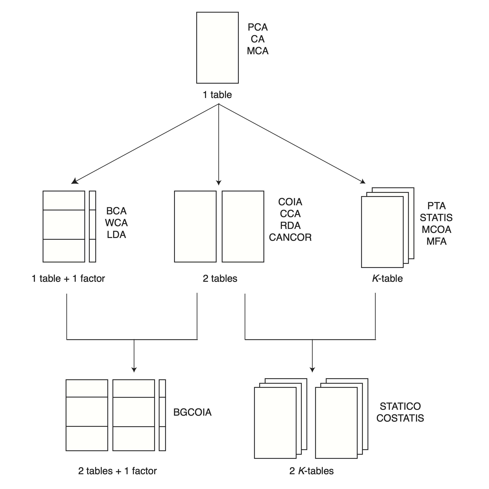
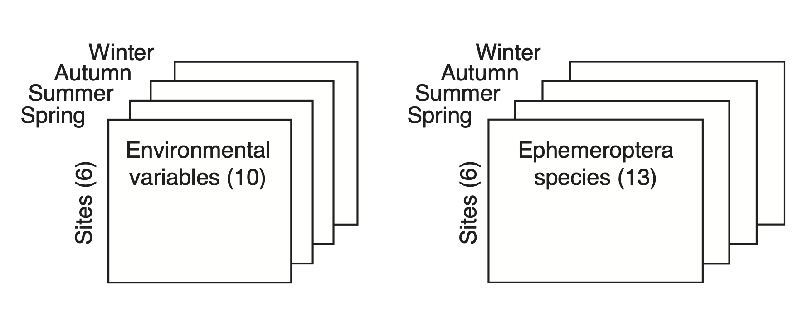
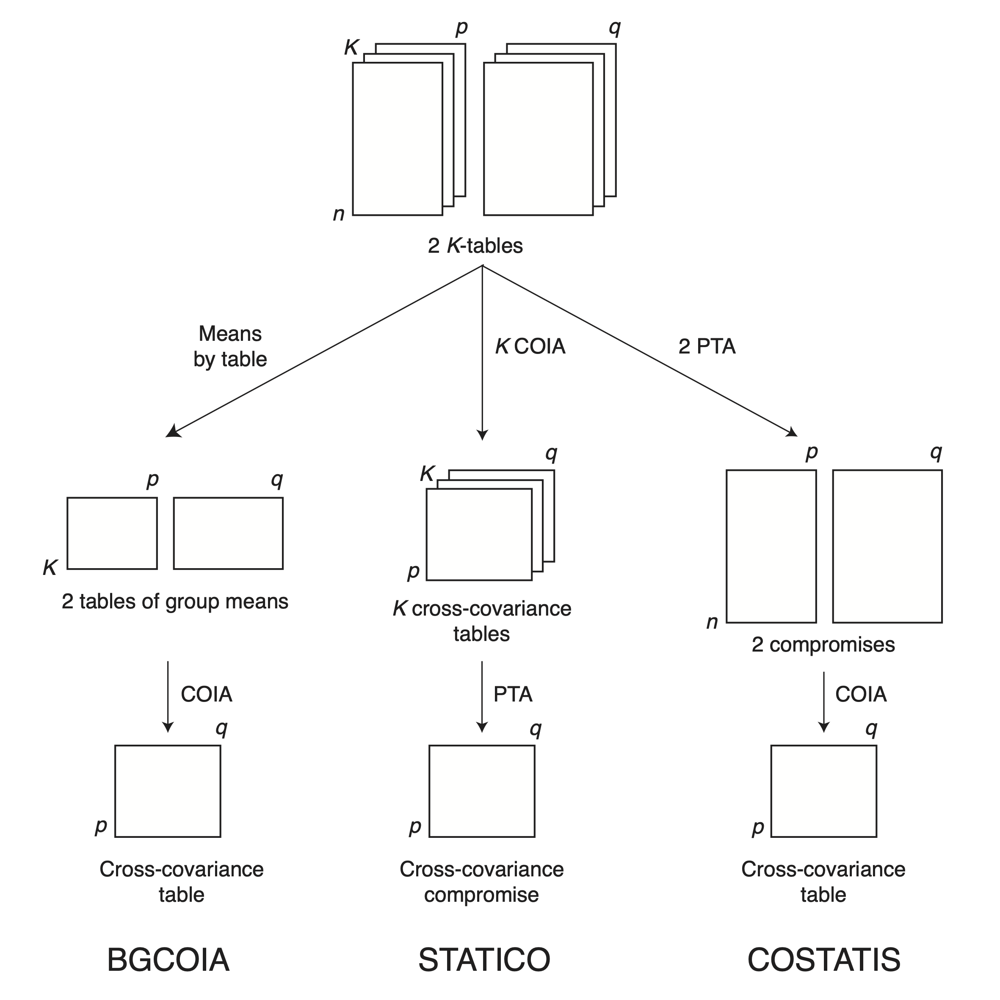

```{r, include = FALSE}
knitr::opts_chunk$set(
#  collapse = TRUE,
  comment = "#>"
)
```

```{r setup, include = FALSE, echo = FALSE}
library(ade4)
library(adegraphics)
```

## Abstract
This chapter is dedicated to the analysis of the changes in species-environment relationships, through the analysis of a series of pairs of tables. Each pair is made of one species table and one environmental variables table. The rows of both tables are identical and correspond to the samples where measures were made. The series of tables comes from the repetition of these two tables at several occasions. Three methods are compared in the chapter: Between-Class Coinertia Analysis, STATICO and COSTATIS.

## Introduction

A series of pairs of ecological tables can be obtained when species data and environmental data are collected several times in the same locations.
This data structure can also be seen as a couple of *K*-tables: one *K*-table relates to species data and a second one to environmental data. 
The study of changes in species-environment relationships can be important, for example, from the point of view of species conservation, or for global change studies. 

We have seen previously that one pair of ecological tables can be analysed with many multivariate data analysis methods (also called ``Coupling methods'', see Vignette "Description of species-environment relationships"). 
We have also seen methods that allow to take into account the existence of groups of samples in a data table (Between-Class and Within-Class Analyses, see Vignette "Taking into account groups of sites"). 
In the previous chapter, we have seen methods that can be used to analyse a *K*-table (*K*-table methods, see Vignette "Analysing Changes in Structures").
Here, we need to mix these three categories of methods in order to be able to analyse one couple of *K*-tables, or one series of pairs of ecological tables. 
The next Figure sums up these three categories of methods and presents the three strategies that can be used to mix them: BGCOIA, STATICO, and COSTATIS.
A comparison of these methods is presented in Thioulouse 2011.


<figcaption align = "center">
Data structures that lead to two *K*-tables analyses. **One table** methods: PCA (Principal Component Analysis), CA (Correspondence Analysis) and MCA (Multiple Correspondence Analysis). **Two tables** coupling methods: COIA (Coinertia Analysis), CCA (Canonical Correspondence Analysis), RDA (Redundancy Analysis) and CANCOR (Canonical Correlations Analysis). Taking into account **groups of rows**: BCA (Between-Class Analysis), WCA (Within-Class Analysis) and LDA (Linear Discriminant Analysis). **$K$-table** methods: PTA (Partial Triadic Analysis), STATIS (Structuration des Tableaux A Trois Indices de la Statistique), MCOA (Multiple Coinertia Analysis) and MFA (Multiple Factor Analysis). Analysis of a series of pairs of ecological tables: **BGCOIA** (Between-Group Coinertia Analysis), **STATICO** (STATIS and Coinertia) and **COSTATIS** (Coinertia and STATIS).

</figcaption>

A real-size example of application to the Ecology of aquatic Heteroptera in the Medjerda watershed (Tunisia) can be found in Slimani 2017. 
In this Vignette, we use the `meau` data set (Pegaz 1980) that we have already seen in Vignette "Taking into account groups of sites".


<figcaption align = "center">
A pair of data cube, or a series of pairs of ecological tables. This example corresponds to the `meau` data set from the **ade4** package.

</figcaption>

## BGCOIA

BGCOIA (see Franquet 1995 for basic mathematical definitions) is a Between-Group Coinertia Analysis. More precisely, it is obtained by considering each table of the sequence as a group. The mean of the columns in each table is computed and arranged in two new tables, with one row corresponding to one table. There is one table for species data means and one table for environmental variables means. A Coinertia Analysis is then done on this couple of mean tables. In the same way as in *K*-table analysis methods, the rows of the initial tables can be projected into this analysis to help interpret the results.

The main advantage of this method is its simplicity, from both theoretical and practical points of view. The two data cubes are reduced to two tables by taking the means of each elementary table of the cubes, and Coinertia Analysis is then applied to the two resulting tables.

In the **ade4** package, BGCOIA can be seen as the Between-Class Analysis of a `coinertia` object. The result is a `betcoi` object (`bgcoia2`).

The following code shows how computations can be performed in the first theoretical framework (Coinertia Analysis of two Between-Class Analyses):

```{r, echo = TRUE}
data(meau)
pca.env <- dudi.pca(meau$env, scannf = FALSE, nf = 4)
pca.spe <- dudi.pca(meau$spe, scale = FALSE, scannf = FALSE, nf = 4)   
bet.env <- bca(pca.env, meau$design$site, scannf = FALSE, nf = 2)
bet.spe <- bca(pca.spe, meau$design$site, scannf = FALSE, nf = 2)
bgcoia1 <- coinertia(bet.env, bet.spe, scannf = FALSE, nf = 3)
names(bgcoia1)
```

In that case, supplementary informations are missing such as projections of individuals and variables from initial tables $X$ and $Y$. 
The following code shows how computations can be performed in the second theoretical framework (Between-Class Analysis of a Coinertia Analysis):

```{r, echo = TRUE}
coi <- coinertia(pca.env, pca.spe, scannf = FALSE, nf = 3)
bgcoia2  <- bca(coi, meau$design$site, scannf = FALSE)
names(bgcoia2)
```

The next Figure shows the results of the BGCOIA on the `meau` data set, with the factor map of Ephemeroptera species, of environmental variables, and of sampling sites.
The factor map for sampling sites is double: there is one map for the rows of the table of environmental variables (red labels), and one map for the rows of the Ephemeroptera species (blue labels). 
Both maps are superimposed, to make comparisons easier.

It is easy to see the pollution gradient (first axis, pollution on the left) and the upstream-downstream physical gradient (second axis, upstream is upward) on the environmental variables map and on the sites map (red labels). 
This structure is very strong and can be found again for the species on the Ephemeroptera map and on the sites map (blue labels). 
See Thioulouse 2011 for further interpretations.


```{r, echo = TRUE, fig.width = 6, fig.height = 6, out.width = 600, out.height = 600, dpi = 300}
ar1 <- s.arrow(bgcoia2$l1, plabels.boxes.draw = FALSE, 
    plabels.cex = 1.5, plot = FALSE)
ar2 <- s.arrow(bgcoia2$c1, plabels.boxes.draw = FALSE, 
    plabels.cex = 1.5, plot = FALSE)
xlim1 <- range(bgcoia2$msX[, 1], bgcoia2$msY[, 1])
ylim1 <- range(bgcoia2$msX[, 2], bgcoia2$msY[, 2])
cl1 <- s.class(bgcoia2$msX, meau$design$site, ellipseSize = 0, 
    xlim = xlim1, ylim = ylim1, ppoints = list(pch = 21, fill = "red"), 
    plabels = list(cex = 1.5, col = "red"), labels = 1:6, plot = FALSE)
cl2 <- s.class(bgcoia2$msY, meau$design$site, ellipseSize = 0, 
    xlim = xlim1, ylim = ylim1, ppoints = list(pch = 21,
    fill = "blue"), plabels = list(cex = 1.5, col = "blue"), 
    labels = 1:6, plot = FALSE)
clt <- superpose(cl2, cl1, plot = FALSE)
ADEgS(list(clt, ar1, ar2), rbind(c(0.2, 0, 1, 1), c(0, 0.6, 0.4, 1),
	c(0, 0, 0.4, 0.4)))
```
<figcaption align = "center">
BGCOIA of the `meau` data set. The Ephemeroptera species factor map (top-left) is drawn with the `s.arrow` function and the coordinates in `bgcoia2$l1`. The environmental variables factor map (bottom-left) is drawn with the `s.arrow` function and the coordinates in `bgcoia2$c1`. The sites factor map (middle graph on the right) is drawn with the `s.class` function and the coordinates in `bgcoia2$msX` (sites for environmental variables, red labels) and in `bgcoia2$msY` (sites for Ephemeroptera species, blue labels).

</figcaption>

## STATICO

The STATICO method was first published in 1999, as a method for the analysis of *K* pairs of tables (Simier 1999, Thioulouse 2004). The principle of the method is simple: the relations between the two tables of each pair are analysed using Coinertia Analysis (see Vignette "Description of species-environment relationships"). During this step, the two tables are crossed, producing a cross-covariance table. In a second step, the series of cross-covariance tables is analysed with a Partial Triadic Analysis (see Vignette "Analysing Changes in Structures").

The particular choice of these methods (COIA and PTA) results in constraints on the set of environmental variables, species and sites that can be analysed by STATICO. The environmental variables must be the same in all the environmental tables, and the list of species must be the same in all the species tables too. Some species (but not too many) may be absent from some species tables, as the values in the corresponding columns can be set to zero. The sampling sites (rows of the tables) must be the same for the two tables of one pair, but they may be different among the series.

The Interstructure step of STATICO, like the Interstructure of the STATIS method, gives optimal weights that are used to build a Compromise. The Compromise of STATICO is a weighted mean of the cross-covariance tables. The analysis of this Compromise gives a graphical display of the environmental variables and of the species. Finally, the Intrastructure step projects the rows and columns of each table of the sequence in the analysis of the Compromise, with usual supplementary element projection technique (Lebart 1984). This gives a display of the environmental variables at each date, of the species at each date, and two displays of the sampling sites at each date (one from the point of view of environmental variables and one from the point of view of species).

STATICO is a Partial Triadic Analysis on the sequence of cross product tables, so the Compromise is also a cross product table, with the 13 Ephemeroptera species in rows and the 10 environmental variables in columns, in the `meau` data set. Sites have disappeared from this table, but they can be projected as supplementary elements to help interpret the results of the analysis. 
The following code shows how computations are performed on the `meau` data set.

```{r, echo = TRUE}
wit.env <- withinpca(meau$env, meau$design$season, scannf = FALSE, scaling = "total")
pca.spe <- dudi.pca(meau$spe, scale = FALSE, scannf = FALSE)
wit.spe <- wca(pca.spe, meau$design$season, scannf = FALSE)
kta.env <- ktab.within(wit.env, colnames = rep(c("S1","S2","S3","S4","S5","S6"), 4))
kta.spe <- ktab.within(wit.spe, colnames = rep(c("S1","S2","S3","S4","S5","S6"), 4))
statico.envspe <- statico(kta.env, kta.spe, scannf = FALSE)
```

The `statico.krandtest` function can be used to test the statistical significance of the Coinertia Analyses on the series of pairs of tables.
This function produces a `krandtest` object and the next Figure shows the result of the plot function on this object.

```{r, echo = TRUE, fig.width = 6, fig.height = 6, out.width = 600, out.height = 600, dpi = 300}
plot(statico.krandtest(kta.env, kta.spe))
```
<figcaption align = "center">
Graphs of the four permutation tests obtained with the `statico.krandtest` function to test the statistical significance of the four Coinertia Analyses.

</figcaption>

The next Figure is a compound graph that sums up the first two steps of the STATICO method: Interstructure and Compromise. It is simply obtained with the generic `plot` function.

```{r, echo = TRUE, fig.width = 6, fig.height = 6, out.width = 600, out.height = 600, dpi = 300}
plot(statico.envspe)
```
<figcaption align = "center">
Interstructure and Compromise of STATICO on the `meau` data set.

</figcaption>

The Interstructure plot (top-left) shows that autumn and summer are the two most important seasons for defining the Compromise, while winter and spring are slightly less important.

The Compromise plots (top-right and bottom-left) are very similar to the BGCOIA plots. They show that the first axis (horizontal) is also a pollution gradient: clean water on the right, and pollution on the left. The second axis (vertical) is also an upstream-downstream physical gradient: discharge (`Flow`) and temperature (`Temp`) increase downstream (downward on the figure). Nitrates (`Nitr`) also increase along the whole stream instead of having a maximum at site 2 like other pollution variables, and this is why they are located here. The sensitivity of all Ephemeroptera species to pollution and the specificity of some species (`Bpu`, `Hla`, `Eda` upstream and `Bsp`, `Eig`, `Ecd` downstream) are also found again. The `Typological value` plot (bottom-right) shows that autumn has the highest influence in the construction of the Compromise, while spring has the lowest.


The next Figure shows the Intrastructure step for **environmental variables** (top) and **Ephemeroptera species** (bottom). It is drawn using the projection of the columns of the two series of tables as supplementary elements in the Compromise analysis (`statico.envspe$Tli` and `statico.envspe$Tco`).

```{r, echo = TRUE, fig.width = 8, fig.height = 4, out.width = 800, out.height = 400, dpi = 300}
sa1 <- s.arrow(statico.envspe$Tli, facets = statico.envspe$TL[, 1], 
    labels = statico.envspe$TL[, 2], psub.cex = 1.5, 
    plabels.col = "red", plabels.boxes.draw = TRUE, plot = FALSE)
sa2 <- s.arrow(statico.envspe$Tco, facets = statico.envspe$TC[, 1], 
    labels = statico.envspe$TC[, 2], psub.cex = 1.5, 
    plabels.col = "blue", plabels.boxes.draw = TRUE, plot = FALSE)
pos1 <- rbind(c(0, 0, 0.25, 1), c(0.25, 0, 0.5, 1), c(0.5, 0, 0.75, 1), 
    c(0.75, 0, 1, 1))
sa1@positions <- sa2@positions <- pos1
ADEgS(list(sa1, sa2), layout = c(2, 1))
```
<figcaption align = "center">
Intrastructure of environmental variables (top) and Ephemeroptera species (bottom) of STATICO on the `meau` data set.

</figcaption>

Autumn is clearly the season where the structures are the strongest (arrows are much longer at this date), both for environmental variables and for Ephemeroptera species. Conversely, spring is the season where the structures are the weakest (arrows are all very short). This confirms the interpretations made on the previous Figure. However, although the structures may vary in intensity, they are preserved across dates: the first axis is always a pollution gradient, and the second one is always an upstream-downstream opposition.

The next Figure shows the Intrastructure step for the **sites**. It is drawn using the projection of the rows of the two sequences of tables as supplementary elements in the Compromise analysis (`statico.envspe$supIX` and `statico.envspe$supIY`). It is very similar to the graph of sites in the BGOIA Figure, but it is split according to seasons instead of sites. The sites of the environmental variables tables are on the first row of graphs while the sites of Ephemeroptera species tables are on the second row. This presentation insists on the comparison between the four seasons, showing mainly the distortions of the upstream-downstream gradient across seasons, as Ephemeroptera species react to pollution increase (maximum reached in autumn) or decrease (minimum in spring).

```{r, echo = TRUE, fig.width = 8, fig.height = 4, out.width = 800, out.height = 400, dpi = 300}
st1 <- s.traject(statico.envspe$supIX, facets = statico.envspe$supTI[, 1],
    plabels.cex = 0, psub.cex = 0, plot = FALSE)
sla1 <- s.label(statico.envspe$supIX, facets = statico.envspe$supTI[, 1],
    psub.cex = 1.5, labels = statico.envspe$supTI[, 2], 
    plabels.col = "red", plot = FALSE)
st2 <- s.traject(statico.envspe$supIY, facets = statico.envspe$supTI[, 1],
    plabels.cex = 0, psub.cex = 0, plot = FALSE)
sla2 <- s.label(statico.envspe$supIY, facets = statico.envspe$supTI[, 1],
    psub.cex = 1.5, labels = statico.envspe$supTI[, 2], 
    plabels.col = "blue", plot = FALSE)
pos1 <- rbind(c(0, 0, 0.25, 1), c(0.25, 0, 0.5, 1), 
    c(0.5, 0, 0.75, 1), c(0.75, 0, 1, 1))
st1@positions <- st2@positions <- pos1
sla1@positions <- sla2@positions <- pos1
s1 <- superpose(st1, sla1)
s2 <- superpose(st2, sla2)
ADEgS(list(s1, s2), layout = c(2, 1))
```
<figcaption align = "center">
Intrastructure of **sites** for environmental variables (top) and for Ephemeroptera species (bottom) of STATICO on the `meau` data set.

</figcaption>

This Figure shows the differences between sites among the seasons for environmental variables (top row). In spring, sites are lined up vertically on the upstream-downstream gradient and only site 2 moves slightly to the left. Structures are clearly weaker during this season and the permutation test (see the `statico.krandtest` Figure) is not statistically significant.

In summer, pollution is highest at site 2, and restoration occurs along sites 3, 4 and 5. In autumn, pollution is maximum because stream flow is at its minimum (pollutants concentrations are maximum). In winter, pollution has almost disappeared, because Autrans is a summer mountain resort, but the upstream-downstream gradient is still disturbed.

The position sites for Ephemeroptera species (bottom row) shows the same structures, because the pollution has a negative impact on  species abundance (horizontal axis) and because of the upstream-downstream preferences of particular species (vertical axis).

## COSTATIS

COSTATIS is also based on *K*-table methods and on Coinertia. 
It benefits from the advantages of both STATICO and BGCOIA. 
Indeed, it has the same optimality properties of *K*-table analyses as STATICO (*i.e.*, the maximising properties of the Compromise), but it retains the simplicity of BGCOIA.

COSTATIS is simply a Coinertia Analysis of the Compromises of the two *K*-table analyses. 
The first step of COSTATIS consists in performing two Partial Triadic Analyses: one on the environmental variables *K*-table, and one on the species *K*-table. 
The second step is simply a Coinertia Analysis of the Compromises of these two Partial Triadic Analyses. 
This means that the number of tables does not have to be the same for the two series of tables, but that the number of species, of environmental variables, and of sampling sites must be the same for all the tables.

The Coinertia Analysis of the two Compromises decomposes the total coinertia and maximises the coinertia between species and environmental variable scores.
An additional step can be implemented: like in the STATICO method, it is possible to project the rows and columns of all the tables of the two series as supplementary elements into the multidimensional space of this Coinertia Analysis.

Each Compromise represents the "stable structure" of the corresponding series. COSTATIS brings to light the relationships between these two stable structures, and it discards the conflicting variations between the whole sequences. It is therefore very easy to interpret (like a standard Coinertia Analysis), yet it retains the optimality properties of the Compromises of the two Partial Triadic Analyses.

In the **ade4** package, the `costatis` function is used to compute a COSTATIS Analysis. All the outputs are grouped in a `dudi` object (subclass `coinertia`).

The call to the `costatis` function just passes the two *K*-tables, using the same syntax as the `statico` function:

```{r, echo = TRUE}
costatis.envspe <- costatis(kta.env, kta.spe, scannf = FALSE)
```

COSTATIS results are presented in the next Figure. COSTATIS is a Coinertia Analysis, and it is therefore possible to use a permutation test to assess the statistical significance of the relationships between the two tables, just like in a usual Coinertia Analysis. The result of this permutation test (function `costatis.randtest`) gave a *p*-value of 0.005.

```{r, echo = TRUE, fig.width = 8, fig.height = 4, out.width = 800, out.height = 400, dpi = 300}
sa1 <- s.arrow(costatis.envspe$c1 * 4, xlim = c(-3, 2), ylim = c(-2, 3), 
    plot = FALSE)
sc1 <- s.class(costatis.envspe$supIX, meau$design$site, ellipseSize = 0, 
    xlim = c(-3, 2), ylim = c(-2, 3), plabels.col = "red", 
    plot = FALSE)
s1 <- superpose(sa1, sc1)
sa2 <- s.arrow(costatis.envspe$l1 * 3, xlim = c(-2, 2), 
    ylim = c(-2.5, 1.5), plot = FALSE)
sc2 <- s.class(costatis.envspe$supIY, meau$design$site, ellipseSize = 0, 
    xlim = c(-2, 2), ylim = c(-2.5, 1.5), plabels.col = "blue", 
    plot = FALSE)
s2 <- superpose(sa2, sc2)
ADEgS(list(s1, s2))
```
<figcaption align = "center">
Results of the COSTATIS analysis on the `meau` data set.

</figcaption>

The Coinertia Analysis is done on the Compromises of two *K*-table analyses. 
Here, we used two Partial Triadic Analyses, but the results of these two analyses are not presented. 
We show only the plots of the Coinertia Analysis, under the form of two biplots: one for environmental variables (left), and one for Ephemeroptera species (right). 
These two biplots are at the same scale and in the same space, so they could be superimposed on the same figure.
Presenting the results in this way underlines the fact that COSTATIS is looking for the relationships (co-structure) between the stable structures extracted from two series of tables.

The left graph shows the results for the environmental variables. 
The same structure as the one detected by STATICO and BGCOIA is observed.
The first axis is the pollution gradient (pollution on the left) and the second is the upstream-downstream opposition (downstream is upward).
The four dates for each site are projected on this plot and, like in the BGCOIA plot, the four points corresponding to the four sampling dates of each site are grouped to form a star. The gravity center of these four points is labeled with the number of the site. The four points of site 2 are on the left, as pollution is higher in this site for the four dates (except for site 3 in winter). Pollution decreases downstream along sites 3, 4 and 5, and is the lowest at site 6.

The second biplot is presented at the right. 
It shows the Ephemeroptera species, with the same opposition between upstream and downstream characteristic species.
In the same way as in the figure of environmental variables, the four dates for each site are projected on the plot and the corresponding four points are grouped to form a star.
The gravity center of these four points is labeled with the number of the site.
The position of sites corresponds to the abundance of the species in these sites: sites 2 and 3 have the lowest number of Ephemeroptera, so they are far on the left. 
Site 1 has the highest number of species `Eda`, and sites 5 and 6 have the highest number of species `Bsp`, `Brh` and `Eig`. 

The first axis common to these two biplots (*i.e.*, the first COSTATIS axis) maximises the covariance between the coordinates of the ``Compromise variables'' and the ``Compromise species''.
The result is that it displays the relationships between the stable structures extracted from the two data sets. 
On this example, this relationship is the fact that the pollution gradient affects the abundance of Ephemeroptera species. 
The second axis represents the upstream-downstream opposition, and the relationships between ecological preferences of Ephemeroptera species and physical variables or stream morphology.

## Conclusion

In this Vignette, we presented the principles and some examples of use of three methods for analysing a series of pairs of data tables (or a pair of data cubes): BGCOIA, STATICO and COSTATIS. The next Figure shows a comparison of the three approaches.

BGCOIA is a Between-Group Coinertia Analysis. It is therefore simply computed by doing a Coinertia Analysis on the two tables of group means, considering each table as a group (Franquet 1995).

In STATICO, we first use Coinertia Analysis $K$ times to compute the sequence of $K$ cross-covariance tables, and then Partial Triadic Analysis to analyse this new *K*-table. Symmetrically in COSTATIS, we first use two Partial Triadic Analyses to compute the Compromises of the two *K*-tables, and then Coinertia Analysis to analyse the relationships between these two Compromises.


<figcaption align = "center">
Comparison of the three methods. 
BGCOIA is a Between-Group Coinertia Analysis, considering each table of the series as a group. STATICO is a Partial Triadic Analysis on the series of cross-product tables obtained by crossing the two tables of a pair at each date. 
COSTATIS is a Coinertia Analysis of the Compromises computed by the Partial Triadic Analysis of the two *K*-tables. 
In BGCOIA, the mean of the variables in each table is computed and arranged in two new tables.
A Coinertia Analysis is then done on this couple of new tables. 
In STATICO, $K$ cross-covariance tables are computed from the two *K*-tables, resulting in a new *K*-table. 
A Partial Triadic Analysis is then done on this new *K*-table. 
In COSTATIS, two Partial Triadic Analyses are used to compute the Compromises of the two *K*-tables.
A Coinertia Analysis is then used to analyse the relationships between these two Compromises.

</figcaption>

The three methods presented here uncover the same features in the example data set. 
This is a small data set, but with strong structure, and strong structures often are clear with any method. 
However, the three methods used to analyse even a data set with clear structure can have advantages and drawbacks.
The advantages of these methods can be summarised as follows:

- BGCOIA: It is the most straightforward method. It is simple to apply and outputs are easy to interpret. It can be used to favor one point of view (for example, space *vs.* time), by choosing the factor of Between-Class Analysis. It can also be used in conjunction with WGCOIA (Within-Group Coinertia Analysis, Franquet 1994) to study an effect (time) after removing the other (space).

- STATICO: The main advantage of this method is the optimality of the Compromise (maximisation of the similarity with all the initial tables). 
It gives a Compromise of co-structures, which means that it displays the stable component of species-environment relationship variations. 
It benefits from the three-steps computation scheme of STATIS-like methods (Interstructure, Compromise, Intrastructure), and graphical outputs can be very detailed.

- COSTATIS: This method benefits from the advantages of the two others: optimality of the Partial Triadic Analysis Compromises, ease of use, simplicity of Coinertia Analysis graphical outputs.
COSTATIS is the Coinertia Analysis of two Compromises, so it looks for the relationships between two stable structures.
This is different from the STATICO point of view (co-structure of two Compromises *vs.* Compromise of a series of co-structures).

