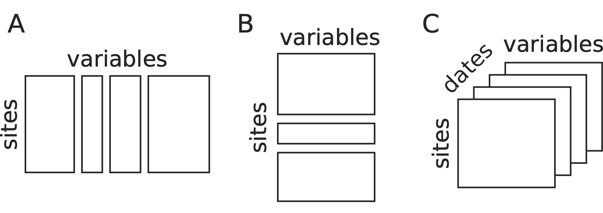
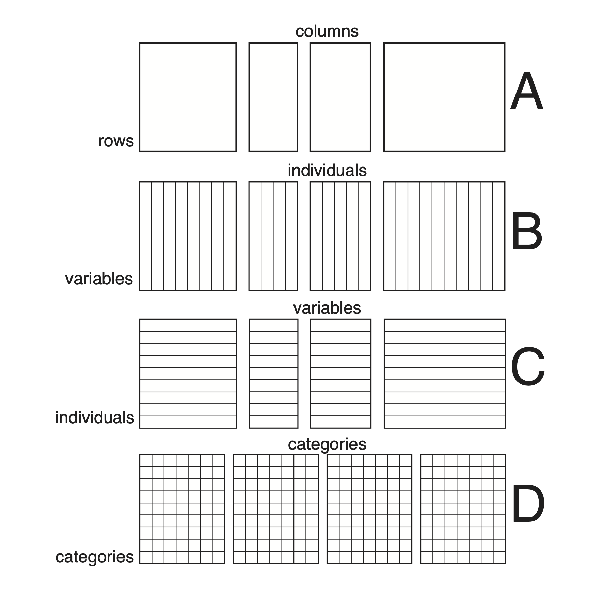
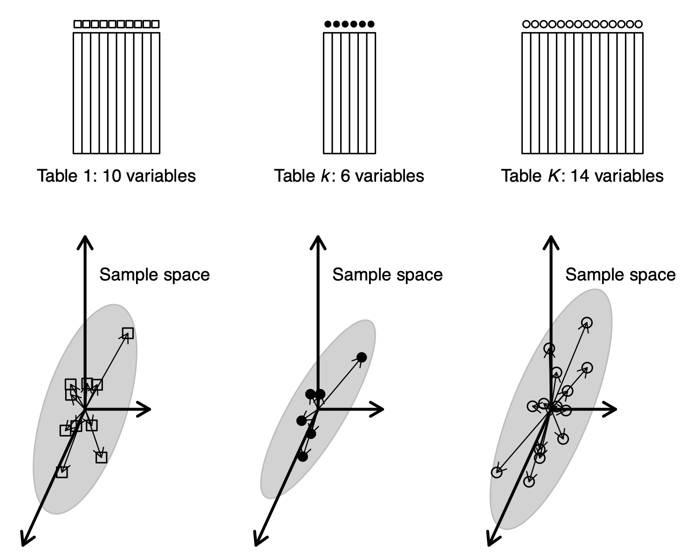
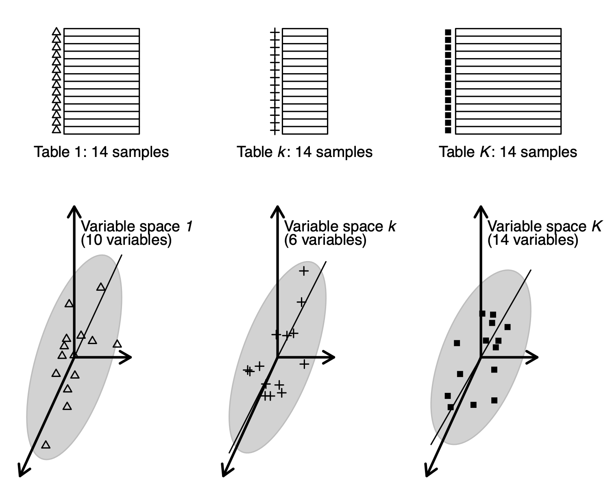

```{r, include = FALSE}
knitr::opts_chunk$set(
#  collapse = TRUE,
  comment = "#>"
)
```

```{r setup, include = FALSE, echo = FALSE}
library(ade4)
library(adegraphics)
```

## Abstract
This vignette is a short introduction to the $K$-table family of methods. We first present some examples of ecological $K$-table, the structure of the `ktab` object used in the **ade4** package to store a $K$-table, and the functions that allow to build and manage them. We briefly present three types of methods: STATIS, Multiple Factor Analysis, and Multiple Coinertia Analysis. We explain the differences between these three groups of methods, with several examples of use.

## Introduction

When the set of samples (rows of a data table) is split into groups, we have seen in vignette "Taking into account groups of sites" that several data analysis methods can take into account these groups and model their differences (Between-Class Analysis) or remove these differences (Within-Class Analysis). Another approach consists in considering that the groups correspond to separate tables, with successive tables stacked vertically (see Figure, B). This leads to what is called the $K$-table structure. 

The set of columns (environmental variables or species) can also be split into groups, and this also leads to a $K$-table structure. One can imagine that, in this case, tables are stacked horizontally (see Figure, A).


<figcaption align = "center">
Structures of data of $K$-table. (A) Several sets of variables measured on the same sites. (B) A set of variables measured for different groups of sites. (C) An example of a data cube with the measurements of the same variables for the same sites repeated at different dates.

</figcaption>

The aim of analysing a set of tables instead of just one table is to find out what makes these tables different, or conversely, to find common points among all the tables. Are all the tables structured in the same way ? Is the samples typology and the variables/species typology the same across all the tables, or are there some changes from one table to another ? These questions are particularly interesting when the series of tables is a time series, with each table corresponding to one date (see Figure, C). But the series of tables can also correspond to other criteria, like taxonomic groups for species, or geographical regions for samples.

## $K$-table management in **ade4**

### $K$-table examples


Here are a few examples of $K$-table data sets taken from **ade4** that correspond to the different cases presented in the previous Figure. The `friday87` data set (Friday 1987) contains one table (`friday87$fau`) with 91 macro-invertebrate species sampled in 16 ponds. The 91 species are grouped in 10 taxonomic groups: Hemiptera, Odonata, Trichoptera, Ephemeroptera, Coleoptera, Diptera, Hydracarina, Malacostraca, Mollusca, Oligochaeta. These species data can be considered as a $K$-table with 10 tables (one for each taxonomic group), each table having 16 rows and a number of columns equal to the number of species in each group (11, 7, 13, 4, 13, 22, 4, 3, 8, 6 respectively). This data set corresponds to the case presented in case A of the previous Figure.

```{r, echo = TRUE}
data(friday87)
dim(friday87$fau)
friday87$fau.blo
```

The second example belongs to the field of hydrobiology. In **ade4**, the data set is called `jv73`, and it comes from the PhD thesis of J. Verneaux (Verneaux, 1973. It is a list with six components. The physico-chemistry table (`jv73$phychi`) has 92 rows (92 sites located along 12 rivers) and 12 variables. A factor (`jv73$fac.riv`) gives the name of the stream on which each site is located. This data set corresponds to the case B presented in the previous Figure.


```{r, echo = TRUE}
data(jv73)
names(jv73)
dim(jv73$phychi)
table(jv73$fac.riv)
```

The third example comes from a paper by Blondel 1988 about the influence of vegetation successions on bird communities composition in European forests. The `bf88` data set in the **ade4** package contains the number of birds of 79 species observed in four regions (Burgundy, Provence, Corsica, Poland) along a gradient of six stages of vegetation succession (from 1: "open, bushy growth less than 1 m" to 6: "closed, forest with trees higher than 20 m"). Data are arranged in a list of six data frames, corresponding to the six ecological stages, each data frame having 79 rows (bird species) and four columns (the four regions). This data set corresponds to a data cube as presented in case C of the Figure, with vegetation stages instead of dates.

```{r, echo = TRUE}
data(bf88)
names(bf88)
dim(bf88$S1)
```

### Building and using a $K$-table

In **ade4**, a $K$-table is stored in an object of class `ktab`. 
A `ktab` object is a list of data frames that share the same row names and the following seven additional components:

- `lw`: row weights, common to all the tables (vector)
- `cw`: column weights (vector)
- `blo`: number of columns of each table (vector)
- `TL`: index for rows (data frame: table number, row number)
- `TC`: index for columns (data frame: table number, column number)
- `T4`: index for 4 elements of an array (data frame: table number, 1:4), mainly for internal use
- `call`: function call

The tables must share the same row names and row weights. This means that one can consider the tables of a `ktab` as stacked horizontally. If the common dimension of the tables is the columns (tables stacked vertically), they must be transposed to have their common dimension as rows:



<figcaption align = "center">
Organisation of a $K$-table in **ade4**. All the tables of a `ktab` must have the same rows (they must share the same row names and row weights), but their columns may be different (A). This is an arbitrary choice and it does not mean that only tables with the same individuals and different variables can be used. Indeed, tables having the same variables but different individuals can be transposed to fit in this scheme (B), while tables having the same individuals and different variables can be used `as is' (C). Of course data cubes with the same rows and the same columns (e.g., three-way contingency tables) can also fit (D). Note that tables that do not have at least one dimension (rows or columns) in common cannot be analysed in the framework of $K$-table methods.

</figcaption>

There are five functions to build a `ktab`. They differ by the type of objects from which they start:

- `ktab.list.df`: a list of data frames with the same rows. This function is adapted for cases A and C. It can be used for case B if data frames are firstly transposed.
- `ktab.list.dudi`: a list of `dudi` objects with the same rows. This function is adapted for cases A and C.  It can be used for case B if `dudi` objects are firstly transposed.
- `ktab.within`: an object created by a `wca` analysis. This function is adapted for cases A and C.
- `ktab.data.frame`: a data frame that should be splitted by columns and a vector indicating the number of columns in each table. This function is adapted for cases B and C. It can be used for case A if the data frame is firstly transposed. 
- `ktab.match2ktabs`: a pair of `ktab` objects with the same structure.

Note that the transformation of the data table (e.g., centring and standardisation) must be performed during the creation step of the `ktab` object and that row and column weights must also be set at this stage.

Some functions (`ktab.list.df`, `ktab.data.frame`) allow to introduce any arbitrary data transformation and row or column weights, while others (`ktab.list.dudi`, `ktab.within`, `ktab.match2ktabs`) use the data transformation and row and column weights of a previous analysis of the data set. 

In the example presented in the next Figure, the `scalewt` function is used to standardise the data table and the `ktab.list.df` function creates a standardised PCA `ktab` object, with the default uniform row  and column weights. 

In the next Figure, the `ktab.within` function uses the `dudi` object created by the `withinpca` function to perform a "Bouroche transformation" where the `ktab` object can be  partially standardised (standardisation of each table separately) or  totally standardised (centring of each table separately and global standardisation).

Several other functions can then be used to manage `ktab` objects:

- `c`: concatenates several `ktab` objects sharing the same rows
- `[]`: selects tables, rows and/or columns in a `ktab`
- `is.ktab`: tests if its argument is a `ktab`
- `t`: transposes all the tables of a `ktab` (tables must have the same column names and weights)
- `row.names`: returns or modifies the vector of row names shared by all the tables
- `col.names`: returns or modifies the vector of column names
- `tab.names`: returns or modifies the vector of table names
- `ktab.util.names`: automatically builds unique row, column and tab names

### Separate analyses of a $K$-table

The simplest way to use a `ktab` is to do the separate analysis of each table. This can be done automatically for all the tables of a `ktab` using the `sepan` function. The exact analysis that is performed depends on the data transformation and on the row and column weights. For example, if a table of quantitative variables is centred and standardised with uniform row and column weights, then the separate analyses are standardised PCAs.

As an example, we can use again the `meaudret` data set (Pegaz, 1980) that we have already seen in previous vignettes. 
We compute the PCA of environmental variables measured in the five sampling sites, but separately for each season with the `sepan`function.
The table of environmental variables `meaudret$env` is first centred and standardised for each season, using the `by` and `scalewt` functions and the `meaudret$design$season` factor. 
The `by` function returns a list of matrices that must be turned into data frames before they can be used in the `ktab.list.df` function. 
The `ktab` object `ktam` is built and the `sepan` function is used to perform a PCA on each table. 
The `kplot` function can then be used to plot the four separate biplots (see the following Figure).


```{r, echo = TRUE, fig.width = 6, fig.height = 6, out.width = 600, out.height = 600, dpi = 300}
data(meaudret)
env <- by(meaudret$env, meaudret$design$season, scalewt)
ktam <- ktab.list.df(lapply(env, as.data.frame),
    rownames = paste("S", 1:5, sep = ""))
sep1 <- sepan(ktam)
kp1 <- kplot(sep1, posieig = "none", psub.cex = 0, plot = FALSE)
tr1 <- s.traject(sep1$Li, facets = sep1$TL[, 1], plabels.cex = 0, 
    col = "red", psub.cex = 2, plot = FALSE)
s1 <- superpose(kp1, tr1)
plot(s1)
```

<figcaption align = "center">
Plot of the four separate PCA (one for each season) of the `meaudret` data set. Physico-chemical variables are represented by their labels with arrows from the origin, and the five sites (`S1` to `S5`) are linked by upstream-downstream red arrows.

</figcaption>

We can see that the same structure is reproduced during each season, with the first principal component representing a pollution gradient (highly polluted sites on the left) and the second one showing the upstream-downstream morphological gradient (Flow, Temperature).

The problem with this Figure is that each analysis has been computed independently from the three others. This means that they are not at the same scale, they cannot be superimposed or even compared. Indeed nothing guarantees that one axis in one figure will correspond to the same structure in another figure. Axes can be inverted, or even be completely different.

We need a way to have these four figures at the same scale and in the same space and this is the objective of $K$-table methods.

## Strategies of $K$-table methods

According to the structure of the $K$-table and the type of data, different methods can be used:

- **Partial Triadic Analysis** is restrictred to data cubes where all tables have the same individuals and variables
- **Foucart COA** is restrictred to three-ways contingency tables (i.e., data cubes with counts where rows and columns correspond to categories)
- **STATIS on operators** allows to deal with $K$-tables with at least the same individuals (STATIS on WD) or at least the same variables (STATIS on VQ)
- **Multiple Factor Analysis** is restricted to $K$-tables with at least the same individuals
- **Multiple Coinertia Analysis** is originally restricted to $K$-tables with at least the same individuals but can be applied on $K$-tables with at least the same variables if they have been firstly transposed.

The first two methods are also named "STATIS on tables". Both "STATIS on tables" and "STATIS on operators" methods share many similarities. 
All these methods can be decomposed in three steps, called the Interstructure, the Compromise and the Intrastructure (Lavit 1988, Lavit 1994). The Interstructure uses the RV coefficients to compute a matrix of scalar products between the tables that measures their relationships.
When all the tables have both the same rows and columns, STATIS, and the associated computation of the RV coefficient, is performed directly on tables. 
Two analyses have been developed in this case: Partial Triadic Analysis (Thioulouse 1987) and Foucart Correspondence Analysis (Foucart 1978, Pavoine 2007). 

When the tables have only one common dimension (rows or columns), the analysis, including the computation of RV coefficients, is performed on Escoufier operators (Escoufier 1973).
In this framework, the RV coefficient is a multivariate generalisation of the squared correlation coefficient that allows to measure the link between two tables with only one common dimension (rows or columns). It is used for example in Coinertia Analysis. The case where the rows (sites or samples) are common to all the tables is called STATIS-WD, while the case where the columns (variables or species) are in common is called STATIS-VQ.

Then, the Compromise is computed as a combination of the $K$ tables, and the Intrastructure projects the elements (rows and columns) of each table onto the analysis of the Compromise. This approach gave rise to many generalisations (see for example Abdi 2012).

## Partial Triadic Analysis

The theoretical background of Triadic Analysis was established in the PhD thesis of Jaffrenou, 1978. He showed that it was in fact equivalent to Tucker's Three Mode Factor Analysis (Tucker, 1966). An application of a particular case (called "Partial Triadic Analysis") to ecological situations was published by Thioulouse, 1987. The extension to the complete case ("Complete Triadic Analysis") was then explained by Kroonenberg 1989, in the framework of Three-mode Principal Component Analysis (Kronenberg, 1983).

The main characteristic of PTA is its simplicity: computations can be done with a simple PCA software, and interpretations are usually easy. One drawback is the constraint on the number of samples and variables that have to be the same for all the tables. Several recent examples of application can be found in hydrobiology (Rolland 2009, Bertrand 2010, Mendes 2010, Slimani 2017).


In the **ade4** package, a PTA can be computed using the `pta` function. 
All the outputs are grouped in a `dudi` object (subclass `pta`).

The results on the `meaudret` data set are shown in the next Figure. The first step uses the `withinpca` function to compute a within-class PCA, with the Bouroche "Partial" standardisation (Bouroche, 1975). This means that, after a global centring and standardisation, variables are standardised separately within each table. Variables have therefore a null mean and unit variance in each table.
The `ktab` object `kta1` is then built with the `ktab.within` function and the same column names are given to the four tables. The `ktab` is then transposed to have variables in columns, and the PTA is computed with the `pta` function:

```{r, echo = TRUE, fig.width = 6, fig.height = 6, out.width = 600, out.height = 600, dpi = 300}
wit1 <- withinpca(meaudret$env, meaudret$design$season, scannf = FALSE, scaling = "partial")
kta1 <- ktab.within(wit1, colnames = rep(c("S1", "S2", "S3", "S4", "S5"), 4))
pta1 <- pta(t(kta1), scannf = FALSE)
plot(pta1)
```
<figcaption align = "center">
Plot of the PTA of the `meaudret` data set (Interstructure and Compromise steps).

</figcaption>

The `plot` function draws the final Figure. The Interstructure graph (top-left) shows that the winter table structure is different from the structure of the three other seasons. The two graphs of the Compromise (Rows = sites plot and Columns = variables plot) show the pollution gradient on the first axis and the upstream-downstream morphology gradient on the second. The `Typological value` graph (bottom-right) gives the importance of each table in the Compromise and shows that winter contributes less than the other seasons to the Compromise structure.

The `kplot` function can then be used to draw the Intrastructure graphs. 
This figure displays the projection of the rows and columns of the four tables and of the principal axes and components of the four PCA.
It shows how the structure of each table (or its principal axes) differs from the structures of the others but interpretation is easier.

```{r, echo = TRUE, fig.width = 6, fig.height = 6, out.width = 600, out.height = 600, dpi = 300}
kplot(pta1)
```
<figcaption align = "center">Plot of the PTA of the `meaudret` data set (Intrastructure step). The first column of graphs shows the projection of the principal axes of the PCA of each table into the PTA. The second column shows the factor map of sites. The third column shows the factor map of physico-chemical variables. The fourth column shows the projection of the principal components of the PCA of each table into the PTA.

</figcaption>

The next Figure is the same type of display as the figure of the `sepan` analysis (one graph for each season), but it uses the coordinates of the Intrastructure step of the PTA. Compared to the `sepan` analysis Figure, the graphs of the four seasons are now at the same scale and can be superimposed and compared. All the points are in the same space, so the two axes have the same meaning in all the graphs. In the present case, the interpretation is not changed, because the structures are very strong and the four separate PCA had already given the same picture. But in the case where structures are weaker, or when they are more different across tables, using a $K$-table approach could help get a better idea of the global structure, and how it is distorted in each table.

```{r, echo = TRUE, fig.width = 6, fig.height = 6, out.width = 600, out.height = 600, dpi = 300}
ar1 <- s.arrow(pta1$Tco * 3, facets = pta1$TC[, 1], psub.cex = 2, 
    labels = pta1$TC[, 2], plot = FALSE)
tr1 <- s.traject(pta1$Tli, facets = pta1$TL[, 1], plabels.cex = 0, 
    psub.cex = 0, col = "red", plot = FALSE)
la1 <- s.label(pta1$Tli, facets = pta1$TL[, 1], psub.cex = 0, 
    labels = pta1$TL[, 2], plot = FALSE)
s1 <- superpose(tr1, la1)
s2 <- superpose(s1, ar1)
plot(s2)
```
<figcaption align = "center">Plot of the PTA of the `meaudret` data set (Intrastructure step) split by season.

</figcaption>

## Foucart COA

The aim of Foucart COA is to coordinate the Correspondence Analyses of a series of contingency tables crossing the same two variables (Pavoine, 2007). Because of the properties of contingency tables, Foucart COA is even simpler than PTA, both from a theoretical point of view and for the implementation in **ade4**. Indeed, the Compromise table is simply the mean of the frequencies of all the contingency tables, and the `foucart` function in **ade4** simply takes a list of data frames as argument instead of a `ktab`. 

In the **ade4** package, the `foucart` function is used to compute a Foucart COA and all the outputs of this function are grouped in a `foucart` object.

The `bf88` data set can be used to illustrate this method:

```{r, echo = TRUE, fig.width = 6, fig.height = 6, out.width = 600, out.height = 600, dpi = 300}
fou1 <- foucart(bf88, scannf = FALSE, nf = 3)
plot(fou1, psub.cex = 2, col.plabels.col = "red", 
    colB.plabels.col = "red", rowB.plabels.optim = TRUE)
```
<figcaption align = "center">Plot of the Foucart COA of the `bf88` data set.

</figcaption>

This Figure is a summary of the Common structure and of the Intrastructure of this analysis. The two graphs on the top of the figure are the row and column graphs of the Common structure (mean of the contingency tables). They show the list of bird species (left) and the four regions (right).

The bottom two graphs show the Intrastructure, *i.e.*, the projections of the rows and columns of the six contingency tables into the analysis of the Common structure. They display the projection of the 79 bird species (left) and of the four regions (right) for the six stages of vegetation succession.

The `kplot` function can be used to draw the next Figure. This is also a display of the Intrastructure, but here the six stages of vegetation succession are split in six separate graphs (S1 to S6). The 79 bird species and the four regions are displayed in each graph, showing the changes in bird species composition and relative region positions changes along the vegetation gradient. 

```{r, echo = TRUE, fig.width = 12, fig.height = 8, out.width = 600, out.height = 400, dpi = 300}
kplot(fou1, col.plabels = list(cex = 3, col = "red", 
    label = fou1$TC[, 2]), row.plabels = list(cex = 2, 
    label = fou1$TL[, 2], plabels.boxes.draw = FALSE), 
    psub.cex = 3, pgrid.text.cex = 2)
```
<figcaption align = "center">`kplot` of the Foucart COA of the `bf88` data set.

</figcaption>

The final interpretation is made easier on the next Figure, where only the coordinates of the four regions in the Intrastructure is kept.
Grey level polygons are used to show the between-regions variability of bird species composition along the gradient of vegetation succession. 
This variability is high in the first three stages (1-3, light grey polygons), and low in the last three (4-6, dark grey polygons). 
This corresponds to the bird species composition convergence in forest environments.

```{r, echo = TRUE, fig.width = 6, fig.height = 6, out.width = 600, out.height = 600, dpi = 300}
pols <- s.class(fou1$Tco, fou1$TC[, 1], ppolygons.col = gray(5:0/6),
    chullSize = 1, starSize = 0, ellipseSize = 0, plabels.cex = 0,
    plegend.drawKey = FALSE)
pols <- s.label(fou1$Tco, add = TRUE)
```
<figcaption align = "center">Interpretation of Foucart COA of the `bf88` data set.

</figcaption>

## STATIS on operators

When the tables of a $K$-table have only one dimension in common, the STATIS method uses the Escoufier operators to compare the tables. 

Two cases are usually considered: (i) the tables of the series have the same columns (variables) or (ii) the same rows (individuals or samples). If tables have different rows \emph{and} different columns, then none of these methods can be used.

When variables are identical across all the tables, then STATIS compares covariance matrices (VQ) and analyses similarities between variables. This is called the "STATIS on VQ" strategy.

The "STATIS on WD" strategy is used when the tables have the same rows. It compares matrices of scalar products between individuals (WD), and analyses similarities between individuals.

In the **ade4** package, these differences are not considered and the `statis` function can be used to analyse both situations. The drawback is that the `ktab` object must take this into account. In all cases, the rows of all the tables must be identical, and the `ktab` must be prepared accordingly. If variables are the same for all the tables and individuals differ (STATIS on VQ), then the tables must be transposed to have the common dimension in rows.


All the outputs of the `statis` function are grouped in a `statis` object.

In the `friday87` data set, the `fau` data frame containing 91 species grouped in 10 taxa, and one table of environmental variables (`mil`) make up 11 tables with the same rows (16 ponds). 
The fauna and the environmental data frames are bound together into the `w1` data frame with the `cbind.data.frame` function. 
The species are centred, and the environmental variables are standardised. 
The `kta1` $K$-table is then built with the `ktab.data.frame` function:

```{r, echo = TRUE, fig.width = 8, fig.height = 6, out.width = 800, out.height = 600, dpi = 300}
w1 <- cbind.data.frame(scalewt(friday87$fau, scale = FALSE),
    scalewt(friday87$mil))
kta1 <- ktab.data.frame(w1, c(friday87$fau.blo, 11),
    tabnames = c(friday87$tab.names, "Environment"))
sep1 <- sepan(kta1)
plot(sep1, psub.cex = 2, paxes.draw = FALSE)
```
<figcaption align = "center">Eigenvalues of the separate analyses of the `friday87` data set.

</figcaption>

This Figure shows the eigenvalues barcharts of the 11 separate analyses (one for each table). STATIS measures the importance of a table by the sum of the squared eigenvalues, instead of the sum of eigenvalues as it is the case in one-table analyses. This change from the sum (mean) to the sum of squares (variance) is equivalent to the change from abundance to diversity.

The taxa that have the highest importance from this point of view are Diptera, Trichoptera, Mollusca and Ephemeroptera (on two axes). It is interesting to notice that this importance is not related to the richness of taxonomic groups, but to the strength of their structure.

The STATIS analysis is computed with the `statis` function, and the results are displayed according to the three steps of $K$-table analyses: Interstructure, Compromise and Intrastructure.

```{r, echo = TRUE}
statis1 <- statis(kta1, scannf = FALSE)
```

In the Interstructure step, the matrix of RV coefficients between operators is diagonalized, and the resulting eigenvalues can be found in `statis1$RV.eig`. This gives the eigenvalues barchart. The components of the first eigenvector are then used as weights in a linear combination of initial operators.  This linear combination is called the Compromise, and the corresponding weights can be found in `statis1$RV.tabw`.

The correlation circle of the Interstructure can be drawn with the coordinates found in `statis1$RV.coo`. This figure shows the importance (`Typological value`) of each table in the Compromise study. Here, we can see that the structure is not very coherent among tables, and that the environment will not be able to explain the distribution of all taxa. The environmental variables seem to be better related to Oligocheta than to Mollusca, Coleoptera, and Hydracarina.

```{r, echo = TRUE, fig.width = 7, fig.height = 7, out.width = 400, out.height = 400, dpi = 300}
bc2 <- plotEig(statis1$RV.eig, yax = 1, nf = 1, pbackground.box = TRUE,
    psub = list(text = "Eigenvalues", cex=2) , plot = FALSE)
cs2 <- s.corcircle(statis1$RV.coo, pbackground.box = FALSE, plot = FALSE)
ADEgS(list(cs2, bc2), rbind(c(0, 0, 1, 1), c(0, 0.55, 0.45, 1)))
```
<figcaption align = "center">STATIS analysis of the `friday87` data set: eigenvalues barchart and correlation circle of the Interstructure.

</figcaption>

The analysis of the Compromise gives a second eigenvalues barchart with two prominent eigenvalues. These values can be found in `statis1$C.eig`.

```{r, echo = TRUE, fig.width = 8, fig.height = 4, out.width = 800, out.height = 400, dpi = 300}
bcC <- plotEig(statis1$C.eig, yax = 2, nf = 2, pbackground.box = TRUE,
    psub = list(text = "Eigenvalues", cex = 2), plot = FALSE)
slC <- s.label(statis1$C.li, plabels.cex = 1.5, plabels.optim = TRUE,
    plot = FALSE)
ccC <- s.corcircle(statis1$C.Co[statis1$TC[, 1] == "Environment", ],
    pbackground.box = FALSE, plot = FALSE)
ADEgS(list(slC, ccC, bcC), rbind(c(0, 0, 0.5, 1), c(0.5, 0, 1, 1),
    c(0.35, 0, 0.65, 0.4)))
```
<figcaption align = "center">Compromise of the STATIS analysis of the `friday87` data set: eigenvalues barchart (middle), ponds factor map (left), and environmental variables (right).

</figcaption>

The factor map of the Compromise for the 16 ponds (left) is drawn using the coordinates in `statis1$C.li`. The structure observed on this figure corresponds to a differential distribution of several taxa in some ponds: Trichoptera, Ephemeroptera, Hydracarina, Malacostraca, Mollusca and Oligochaeta are mostly absent from ponds on the left (ponds R, E, J, P, Q).

The factor map of the Compromise for variables (species and environmental parameters) can be drawn with the column  coordinates (in `statis1$C.co`). The Figure shows the environmental variables (right). Pond size (area and depth) and water pH are the two main factors that explain the variations in species distributions. Large ponds tend to be in the top part of the graph, while ponds with high pH and hardness tend to be on the right.

This structure can be seen directly in the data. The next figure displays the distribution of the 91 species in the 16 ponds. It is drawn with the `s.distri` function and the following code, that builds a new `ktab` object `kta2`, containing only the species data (excluding the environmental variables table).

```{r, echo = TRUE, fig.width = 8, fig.height = 6, out.width = 800, out.height = 600, dpi = 300}
kta2 <- ktab.data.frame(friday87$fau, friday87$fau.blo)
glc <- list()
for (j in 1:length(friday87$fau.blo)) {
    glc <- c(glc, s.distri(statis1$C.li, kta2[[j]],
	      plot = FALSE, storeData = TRUE, starSize = 0.5, 
	      ellipseSize = 0, pellipses.axes.draw = FALSE,    
	      psub.cex = 2, psub.text = names(kta2)[[j]],
	      pgrid.text.cex = 2, plabels.cex = 1.5))
}
ADEgS(glc)
```
<figcaption align = "center">Distribution of the abundance of the 91 species in the 16 ponds.

</figcaption>

The `for` loop operates on the 10 tables of the `ktab` (the 10 species groups), drawing one graph for each group. The resulting 10 graphs are collected in the `glc` list, and plotted with the `ADEgS` function of the **adegraphics** package.

There is one star for each species, with branches that connect the gravity center of the species to the ponds where it is present. Species are grouped by taxa, and it is easy to see that, for example, Ephemeroptera are present only in ponds on the right (ponds with high pH).

The factor map of the Compromise for columns can be drawn automatically using the `kplot` function, and the `plot` function can be used to draw the synthetic graph of a `statis` object.

The `kplot` function draws a figure that has the same organisation as the graph of species distributions, with one graph for each species group. In each group (*e.g.*, Hemiptera), each species is represented by an arrow with a label giving the species code. This figure also corresponds to the plot of ponds (Compromise analysis), and shows which species is more abundant (or which environmental variable is higher) in each pond.

```{r, echo = TRUE, fig.width = 8, fig.height = 6, out.width = 800, out.height = 600, dpi = 300}
kp1 <- kplot(statis1, plabels.cex = 1.5, psub.cex = 2)
```
<figcaption align = "center">Columns Compromise plot of the STATIS analysis.

</figcaption>

The generic plot of the STATIS analysis (`plot` function) is a collection made of the Interstructure plot (top-left), the rows (ponds) Compromise plot (top-right), the `Typological value` plot (bottom-left), and the component projection plot (bottom-right). The `Typological value` plot gives the importance of each table in the analysis, and the component projection plot shows the projection of the first principal vector of each table on the Compromise factor map.

```{r, echo = TRUE, fig.width = 6, fig.height = 6, out.width = 600, out.height = 600, dpi = 300}
plot(statis1)
```
<figcaption align = "center">Generic plot of the `statis` analysis of the `friday87` data set.

</figcaption>


## Multiple Factor Analysis


Multiple Factor Analysis (Escofier 1994) was developed by B. Escofier and J. Pages in the early eighties (INRIA internal research reports). The aim of MFA is to analyse *K* groups of variables measured on the same individuals. Many variants and extensions have been defined in other situations, like for example tables with mixed quantitative and qualitative variables, variables arranged in a hierarchy, or dual MFA (groups of individuals instead of groups of variables).

Row weights are equal to the row weights of separate tables, and column weights are equal to the concatenated column weights of separate tables. Each table is multiplied by a weight that decreases the importance of large tables and increases the one of small tables.


In **ade4**, the `mfa` function is used to compute a MFA.
All the outputs of this function are grouped in a `mfa` object.

```{r, echo = TRUE, fig.width = 6, fig.height = 6, out.width = 600, out.height = 600, dpi = 300}
afm1 <- mfa(kta1, scannf = FALSE, nf = 2)
plot(afm1, comp = list(plabels.boxes.draw = FALSE, 
    psub.position = "topright"), pgrid.text.pos = "bottomright")
```
<figcaption align = "center">Generic plot of the Multiple Factor Analysis of the `friday87` data set.

</figcaption>

This Figure shows the results of MFA on the `friday87` data set.
The eigenvalues barchart is very similar to the eigenvalues barchart of the STATIS Compromise.
The rows and columns coordinates are used to draw the top two graphs (`Rows` = Rows projection and `Columns` = Columns projection).
The lower left graph (`Components (separate analyses)`) shows the projection of the principal components of each table into the factor map of MFA. 
The result is very similar to the same graph in the STATIS analysis.
The lower right graph (`Link`) displays the link between each table and the Reference Structure. 
It shows for example that the environmental variables table (`Environment`) has no influence on the second component of the MFA, as opposed to the Hemiptera table (`Hemiptera`).

The factor map of the rows (ponds) is displayed in the next Figure. Although computations are completely different, it is also very similar to the Compromise plot of STATIS.

```{r, echo = TRUE, fig.width = 6, fig.height = 6, out.width = 600, out.height = 600, dpi = 300}
s.label(afm1$li, plabels.optim = TRUE)
```
<figcaption align = "center">Plot of the 16 ponds in the MFA of the `friday87` data set.

</figcaption>

It is possible to draw a map of sites (ponds) for each table (taxa), in the same way as in STATIS trajectories. The coordinates of the rows of each table are in `afm1$lisup`. These coordinates can be used to draw a simultaneous display of ponds and taxa, either with taxa grouped by pond (first Figure), or with species split by taxa (second Figure). The first figure underlines the coherence of species composition within each pond, while the second one allows to compare the distribution of species in the ponds for each taxon.

```{r, echo = TRUE, fig.width = 6, fig.height = 6, out.width = 600, out.height = 600, dpi = 300}
s.class(afm1$lisup, afm1$TL[, 2], labels = row.names(afm1$tab))
```
<figcaption align = "center">Plot of the 16 ponds for the eleven taxa in the MFA of `friday87` data.

</figcaption>

In the first Figure, the coordinates of the rows (ponds) for all the tables (taxa) are grouped by pond. A star and an ellipse are drawn for each pond. For example, for pond N (on the right), the 11 branches of the star link the position of pond N for the eleven tables to their gravity center. The ellipse is just a graphical summary of the means, variances and the covariance of the 11 coordinates of the pond. This figure shows that the species composition of ponds can be very different, some ponds sheltering particular taxa.

```{r, echo = TRUE, fig.width = 8, fig.height = 6, out.width = 800, out.height = 600, dpi = 300}
kp2 <- kplot(afm1)
```
<figcaption align = "center">Plot of the 16 ponds for the eleven taxa in the Multiple Factor Analysis of the `friday87` data set. The coordinates of species are split by taxon (plus the set of environmental variables).

</figcaption>

In the second Figure, the same coordinates (`afm1$lisup`, black dots) are used, but they are superimposed to the coordinates of species (`afm1$co`, arrows), and the resulting plot is split by taxa (one graph for each taxon, plus the graph for environmental variables). This figure can be used to compare the distribution of species among the ponds, and it shows very clearly that some taxa prefer particular ponds.

## Multiple Coinertia Analysis

One table can be seen as a cloud of variables in $\mathbb{R}^n$, and as a cloud of samples in $\mathbb{R}^p$. In the same way, $K$ tables can be seen as $K$ clouds of variables *in the same space*. This is the point of view of MFA.


<figcaption align = "center">
$K$ tables can be seen as $K$ clouds of variables in the same sample space (MFA point of view).

</figcaption>

$K$ tables also give $K$ inertia operators and $K$ clouds of samples (or variables) \emph{in the same space}: this is the STATIS point of view.

But $K$ tables can also be seen as $K$ clouds of samples \emph{in K different variable spaces}, and this is the point of view of Multiple Coinertia Analysis.

The successive steps of MCOA can be summed up as follows:

- start from $K$ tables with the same rows;
- $K$ tables define $K$ clouds of points (samples) in $K$ Euclidean spaces. These points are equally weighted in all the clouds. In each space, we look for a normed vector (axis) on which the cloud of points is projected;
- a unit variance reference code is defined;
- axes and reference code optimise the weighted sum of squared covariances between the reference code and the coordinates of each projection. Iterate under orthogonality constraint on axes and codes.


<figcaption align = "center">
$K$ tables can be seen as $K$ clouds of samples in different variable spaces (MCOA point of view).

</figcaption>

MCOA is therefore, axis by axis, the inertia analysis of each table with matched coordinates using synthesis variables (Chessel 1996). The first coordinate is directly given by the first component of MFA. Further ones are more precise from the point of view of the geometry of clouds, but the optimality of the variables representation is lost.

In **ade4**, MCOA is computed using the `mcoa` function:

```{r, echo = TRUE}
mcoa1 <- mcoa(kta1, scannf = FALSE, nf = 2)
```

The plot of MCOA is nearly identical to the plot of MFA, except for an inversion of the second axis.


```{r, echo = TRUE, fig.width = 6, fig.height = 6, out.width = 600, out.height = 600, dpi = 300}
plot(mcoa1)
```
<figcaption align = "center">
Generic plot of the Multiple Coinertia Analysis of the `friday87` data set.

</figcaption>

The `kplot` of MCOA compares the projection of the cloud of points in each space with the synthetic typology (called `Reference` here). 
This strategy can be very useful to link a faunistic $K$-table to an environmental variables table (Concordance Analysis). 


```{r, echo = TRUE, fig.width = 6, fig.height = 8, out.width = 600, out.height = 800, dpi = 300}
kplot(mcoa1)
```
<figcaption align = "center">
`kplot` of the Multiple Coinertia Analysis of the `friday87` data set.

</figcaption>

## Conclusion

The $K$-table data analysis methods that have been broached in this chapter belong to three families: STATIS, MFA and MCOA. When all the tables of the $K$-table have the same individuals and the same variables, the "STATIS on tables" strategy can be used, with for example the PTA and Foucart COA methods. When the tables have only one dimension in common, then the STATIS on WD (same individuals) and STATIS on VQ (same variables) can be used.

When the $K$-table have the same individuals, MFA provides a point of view oriented to the interpretation of the relationships between the variables, with many possible generalisations.

Lastly, MCOA is a generalisation of Coinertia Analysis.
In this example of application, it was used to analyse a \textit{K}-table including ten faunistic tables and an environmental table.
However, in this context, Concordance Analysis (Lafosse 1997, Bady 2004), a generalisation of MCOA to the analysis of $K+1$ tables, could be preferred as it considers explicitly the environmental table as a reference table to ordinate the $K$ faunistic tables. Unfortunately, this method is not yet implemented in **ade4**.

Two other $K+1$ methods are available in **ade4**: Multiblock Partial Least Square (PLS) and Multiblock PCAIV. These two regression-based methods are able to analyse the effect of $K$ explanatory tables on a response table. They are implemented in the `mbpls` and `mbpcaiv` functions (Dray 2019).

Tha last Figure shows the main $K$-table data analysis methods available in the **ade4** package. The `ktab` class allows to handle all these methods in the same way and using the same utility functions. The same $K$-table object can thus be analysed using STATIS, MFA and MCOA and the results of the three methods can be compared easily.


<figcaption align = "center">
The main $K$-table data analysis methods available in the **ade4** package.

</figcaption>

Two methods are particularly simple and easy to use:

- Partial Triadic Analysis, for series of tables having the same rows and the same columns,
- Multiple Factor Analysis, for tables having the same rows and different sets of variables.

The use of the RV coefficient is fundamental for coupling two tables.
Its generalisation to the simultaneous analysis of $K$ tables is the basis of the methods that have been described in this chapter. The analysis of $K$ *pairs of tables* (see vignette "Analysing Changes in Co-structures") is also based of this concept.

